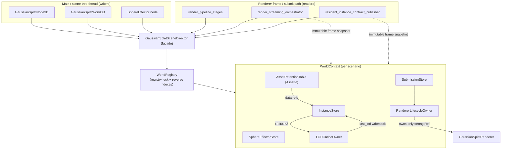

# ADR: Decompose the `GaussianSplatSceneDirector` god-class around owned-state boundaries

- **Status:** Proposed — design-only. This PR adds **no production code**; each
  migration step below lands as its own PR referencing this ADR.
- **Risk class:** R2 for the ADR and the early host-side extraction steps
  (module-local, guarded by existing tests). Steps that reorder renderer/GPU teardown
  or move renderer construction/`initialize()` out from under the lock are R2
  (renderer lifetime / GPU resource ownership) and take GPU/perf review; the
  render-thread snapshot step (Step 6) is R2/R3 and needs runtime/GPU evidence plus a
  second review. Per the agentic-engineering risk classes this design note is the
  R2/R3 *design-before-implementation* artifact.
- **Date:** 2026-07-18 (revised 2026-07-19, review round 2)
- **Baseline:** `384c2c6ad8d` (origin/master). **Re-anchored in review round 2** from
  `237a4b1cc3965fdbd6f12dec825c0e2077b2e9ce`: **PR #628 landed in between and fixed part of
  this ADR's headline hazard**. #628 rewrote ~98 lines of
  `gaussian_splat_scene_director.cpp`, so **every `file:line` anchor in this document has been
  mechanically re-verified and updated against `384c2c6ad8d`** — most `.cpp` anchors shifted by
  +8 to +67 lines and every `.h` anchor by +8. See the §1g correction: reading this ADR against
  the old base, or with the old anchors, will overstate what is still broken.
- **Informs issues:** #356 (decompose orchestration around owned state boundaries —
  the tracked umbrella), #545 (consolidate the four asset-identity schemes behind
  typed IDs), #551 (encode the PREDELETE/EXIT_TREE/prune ordering structurally),
  **#611 (lock-order inversion — *partially fixed* by #628; this ADR owns the residue, §1g)**,
  #606 (raw `GaussianData` storage consumers bypass the RWLock/snapshot contract —
  adjacent; this ADR removes one class of unsynchronized reader).

## Context / problem

`GaussianSplatSceneDirector` is the singleton between the scene-tree nodes
(`GaussianSplatNode3D`, `GaussianSplatWorld3D`, the sphere-effector node) and the
renderer. `ARCHITECTURE.md:20` labels it "Multi-instance coordination and registry"
and puts it at the head of the data flow — nodes register data/instances *through* it,
and it feeds the streaming system → renderer → pipeline stages (`ARCHITECTURE.md:52-58`).
`renderer-lifetime-ownership.md` records the authoritative role: it owns
`worlds: HashMap<RID, SharedWorld>` where each `SharedWorld` holds the **only strong
`Ref<GaussianSplatRenderer>`** — releasing it is the sole path that frees the renderer's
whole GPU graph — guarded by one `mutable Mutex world_mutex` that must never nest with
the manager's L1–L4 lock hierarchy.

It is a god-class: **2,450 LOC** in
`modules/gaussian_splatting/core/gaussian_splat_scene_director.cpp` (recounted at base
`384c2c6ad8d`; the round-1 figure of ~2,383 predates #628), plus the 347-LOC
partial-class TU `scene_director_sphere_effectors.cpp` and `scene_director_internal.h`,
all operating on one nested state blob, `SharedWorld`
(`gaussian_splat_scene_director.h:376-421`), behind a **single coarse mutex**
(`gaussian_splat_scene_director.h:425`). `SharedWorld` fuses at least seven
independent responsibilities under that one lock:

| # | Responsibility | Canonical state (`.h`) | Representative methods (`.cpp`) |
|---|---|---|---|
| 1 | **Renderer lifecycle & ownership** | `SharedWorld::renderer` (`h:378`) | `_get_or_create_world_for_scenario` → `memnew(GaussianSplatRenderer)` (`:368`); `get_shared_renderer` (`:2443`); `teardown_world_for_scenario` (`:2156`); `_should_prune_world`/`_prune_world_if_unused` (`:728`,`:749`) |
| 2 | **Instance registry** | `instances`, `instance_lookup`, `instance_generation` (`h:379-381`) | `register_instance` (`:770`), `update_instance_transform`/`_params` (`:966`,`:1034`), `unregister_instance` (`:1124`) |
| 3 | **Asset retention table** | `asset_records: HashMap<uint64_t, AssetRecord>`, `instance_asset_generation` (`h:401-407`,`h:382`) | `_retain_asset_record`/`_refresh_asset_record`/`_release_asset_record` (`:560`,`:600`,`:628`) |
| 4 | **Sphere-effector registry** | `sphere_effectors`, `sphere_effector_lookup`, `sphere_effector_generation`, `registration_serial` (`h:383-386`) | `update_sphere_effector` (`:1863`), `unregister_sphere_effector` (`:2025`), `_build_sorted_sphere_effector_payload` (`scene_director_sphere_effectors.cpp:26`) |
| 5 | **World-submission store + renderer state restore/rollback** | `world_submission: WorldSubmissionRecord` (`h:387-400`) | `submit_world_submission` (`:2056`), `release_world_submission` (`:2102`), `_apply_world_submission_to_renderer`/`_restore_world_submission_renderer` (`:709`,`:690`) |
| 6 | **LOD walk + memoization** | `InstanceRecord::last_lod` (`h:334`); `lod_walk_*` cache (`h:416-420`) | `update_instance_lods_for_renderer` (`:1227`) |
| 7 | **GPU row/payload building (render thread)** | reads all of the above | `build_instance_buffer_for_renderer` (`:1411`), `build_instance_grading_buffer_for_renderer` (`:1633`), `build_sphere_effector_payload_for_renderer` (`scene_director_sphere_effectors.cpp:154`), `collect_*_assets_for_renderer` (`:2373`,`:2415`) |

`modules/gaussian_splatting/docs/CODEBASE_ASSESSMENT_REPORT.md:55` also records the
**circular dependency** `gaussian_splat_scene_director.h:20` → renderer while the
renderer depends back on core — a layering inversion this decomposition must not deepen.

## 1. Current-state map: contention, reentrancy, and mutation-under-lock hazards

There are **39 `MutexLock lock(world_mutex)` acquisitions** across the two TUs (35 in
`gaussian_splat_scene_director.cpp` + 4 in `scene_director_sphere_effectors.cpp`, recounted at
base `384c2c6ad8d`; round 1 said 38). The lock
is one global mutex over *all* scenarios, so every producer serializes against every
consumer across unrelated worlds. `world_mutex` is the **sole hand-off between two
threads**: the **main / scene-tree thread** (node notifications and property setters —
node processing runs on the main thread via `GaussianSplatManager`'s
`call_deferred(_process_active_nodes_main_thread)`, `gaussian_splat_manager.cpp:610-624,660`)
and the **RenderingServer render thread** (`RendererSceneRenderRD::render_scene` →
`render_scene_instance`, `gaussian_splat_renderer.cpp:2240`), from which every
`*_for_renderer` builder/query executes and which further hops GPU sub-steps onto the RD
command thread via `_dispatch_call_on_render_thread_blocking`.

### 1a. Coarse-lock cross-thread contention (the central defect)

The **render/submit-path** buffer builders and the **main/scene-tree-thread** node
setters take the *same* global lock:

- Render/submit path (called every frame from the renderer —
  `render_pipeline_stages.cpp:314`, `render_streaming_orchestrator.cpp:791,804`,
  `resident_instance_contract_publisher.cpp:350`):
  `build_instance_buffer_for_renderer` (`:1414`), `build_instance_grading_buffer_for_renderer`
  (`:1635`), `build_sphere_effector_payload_for_renderer` (`scene_director_sphere_effectors.cpp:156`),
  `update_instance_lods_for_renderer` (`:1229`), `compute_color_grading_signature_for_renderer`
  (`:1761`), `collect_instance_assets_for_renderer`/`collect_registered_assets_for_renderer`
  (`:2375`,`:2417`).
- Main thread (node setters): `register_instance` (`:775`), `update_instance_transform`
  (`:967`), `update_instance_params` (`:1039`), `update_instance_scene_effector_filter`
  (`:993`), `update_sphere_effector` (`:1874`), `update_instance_color_grading` (`:1689`).

Because the lock is global, a single node moving one splat
(`update_instance_transform`) blocks the render thread's buffer build **for every other
world**, and vice-versa. This is the contention the audit (#356) calls out as hidden
mutable state raising review cost and coupling unrelated features.

### 1b. Expensive / GPU work performed under the global lock

- **Renderer construction under the lock:** `_get_or_create_world_for_scenario` acquires
  the primary `RenderingDevice` and runs `memnew(GaussianSplatRenderer(device))` while a
  caller holds `world_mutex` (`:340-368`); `get_shared_renderer` calls it under the lock
  (`:2444-2445`).
- **GPU initialization under the lock:** `register_instance` calls
  `world->renderer->initialize()` (GPU resource creation) inside its critical section
  (`:815`, under the lock taken at `:775`).
- **Renderer contract mutation + restore under the lock:** `submit_world_submission`
  (`:2062`) calls `renderer->apply_world_submission_contract` (`:720`) and, on rollback,
  `renderer->restore_world_submission_runtime_state` (`:703`) — all while holding the
  global lock, stalling every other world's node updates during a world swap.

### 1c. Reentrancy / calling out of the subsystem while holding the lock

The director repeatedly calls **into engine `Node`/`ObjectDB` state** while holding
`world_mutex`, lengthening the critical section and creating a lock-ordering hazard if
any callout ever re-enters the director:

- `_get_world_for_instance` (`:391-404`) and `_get_world_for_effector` (`:416-427`) call
  `ObjectDB::get_instance`, `node->is_inside_world()`, `node->get_world_3d()` under the lock.
- `_build_sorted_sphere_effector_payload` calls `ObjectDB::get_instance` +
  `Object::cast_to<Node>` per effector under the lock
  (`scene_director_sphere_effectors.cpp:102-104`).
- `get_scene_effector_debug_state_for_instance` calls `ObjectDB::get_instance` and reads
  `effector_node->get_name()` under the lock (`scene_director_sphere_effectors.cpp:228`,`:301-304`).
- Both grading paths read renderer state — `p_renderer->get_color_grading()` — under the
  lock (`:1644`, `:1792`).

This violates the house rule that sub-owners rely on caller synchronization / render-thread
dispatch ordering and never nest `world_mutex` with other locks
(`renderer-lifetime-ownership.md`, lock hierarchy L1–L4).

### 1d. Hidden mutation inside a `const` render-thread query

`_build_sorted_sphere_effector_payload` is invoked from `const` render-path methods, yet
it **mutates canonical state and a generation counter through `const_cast`**: when an
effector's scope-root `ObjectID` no longer resolves it flips `scope_root_valid` and bumps
`sphere_effector_generation` via `const_cast<SharedWorld &>` on the render thread
(`scene_director_sphere_effectors.cpp:106-116`). A write side-effect buried in a `const`
render-thread query means a *read* can invalidate a *cache* mid-frame — exactly the
"never hand out mutation from a const query" anti-pattern the renderer refactor split into
`IFrameStateView` vs `IFrameMutationAccess` (`gaussian-renderer-refactor-memory.md`).

Two precisions that matter for the fix (see §2a): the **liveness test itself is not stale** —
`scope_alive` is recomputed fresh at `:103-104` on every build, so the drop decision is always
current; only the `scope_root_valid` latch and its paired generation bump are stateful. And
the bump the render path issues is read by the render path itself
(`render_streaming_orchestrator.cpp:794`, `:1682`) to decide whether to rebuild — self-invalidation
with no defined ordering. Removing the write therefore requires a replacement trigger, not just
a deletion; §2a defines it.

### 1e. O(worlds) linear scans under the lock

Reverse lookups are unindexed linear scans of every world:
`_find_world_for_instance` (`:407-414`), `_find_world_for_effector` (`:429-436`),
`_find_world_for_renderer` (`:482-517`), `_find_world_for_world_submission` (`:519-541`);
`register_instance` additionally scans every world for the world-switch eviction
(`:787-811`), and `get_instance_submission` scans all worlds (`:1188-1218`) — each inside
the global critical section.

### 1f. Lifetime/teardown ordering encoded in prose (not types)

- **Teardown order (#589): ~~open~~ → FIXED by #628, before this ADR's new base.** The round-1
  text described `register_types.cpp:247-260` (the pre-#628 anchor) deleting
  `GaussianSplatManager` *before* the director, repeating init order instead of reversing it.
  **#628 reversed it**, and the block now lives at `register_types.cpp:256-270`: the
  director destruction block now runs first, so each renderer teardown observes a live manager
  and the correct owning device. The StringName-orphan ordering after both singletons are gone
  was preserved. **This is no longer work for Step 3, and #589 is not an issue this ADR
  closes** — see the Step 3 and D11 corrections. Retained here only so a reader comparing
  against the round-1 revision or the #589 issue text is not misled.
- **Prune-after-unref dance (#551):** ~54-line mirrored comment blocks encode the "unref
  the renderer `Ref` first, *then* re-run the prune so refcount actually falls" ordering
  across node ↔ world ↔ director (`nodes/gaussian_splat_world_3d.cpp:133-186`,
  `nodes/gaussian_splat_node_3d.cpp:460-500`). Correctness depends on prose; any reorder
  silently reintroduces the F6-reload leak.

### 1g. Render-thread-**blocking** renderer calls made under the lock (the headline hazard — now **half fixed**)

> **Correction (review round 2).** The round-1 revision of this section described the hazard as
> entirely open. **It is not: PR #628 (merged, `b7d39df29e4`) fixed the permanent-hang half**,
> which was filed as #611. The remaining half is confirmed live but has a **strictly milder
> failure mode**, and the two must not be conflated — the fixed half could hang the editor
> forever; the remaining half cannot.

#### Fixed by #628 — the indefinite-hang paths

Both sites that dropped a renderer `Ref` under `world_mutex` now move the `Ref` out of the map
under the lock and release it only after the lock is dropped, so `~GaussianSplatRenderer` (whose
dispatch passes `p_allow_timeout = false`, i.e. **no escape**) runs outside the critical section:

- `_prune_world_if_unused` takes a caller-owned `LocalVector<Ref<GaussianSplatRenderer>>`
  declared *before* the `MutexLock`, threaded through all five callers.
- `teardown_world_for_scenario` erases under an inner lock scope and drops the renderer after
  unlocking (`gaussian_splat_scene_director.cpp:2197-2205`).

**Consequences for this ADR:** the §1f/#589 teardown-order item and the corresponding parts of
Step 3 and invariant **D11** are **stale work — already done**. See the §1f and Step 3
corrections below. Do not re-implement them; re-grading a merged fix as new work is how a slice
ends up with no reviewable content.

#### Still live — the timeout-guarded stall paths

The lock-order inversion itself still exists on the world-submission and `initialize()` paths.
Verified against base `384c2c6ad8d`:

| Hop | Site |
|---|---|
| `submit_world_submission` takes `MutexLock lock(world_mutex)` | `gaussian_splat_scene_director.cpp:2062` |
| …still holding it, calls `_apply_world_submission_to_renderer` | `:2088` |
| → `renderer->apply_world_submission_contract(contract)` | `:720` |
| → `set_max_splats(...)` | `render_data_orchestrator.cpp:764` |
| → `initialize()` (when GPU resources are not yet up) | `:776`, `:781` |
| → `set_gaussian_data(...)` / `set_file_backed_payload_source(...)` | `:789-792` |
| → **`_dispatch_call_on_render_thread_blocking`** | `render_quality_orchestrator.cpp:507`; `render_data_orchestrator.cpp:509`, `:557` |

Meanwhile the render thread needs the *same* mutex in the `*_for_renderer` readers:
`build_instance_buffer_for_renderer` (`MutexLock` at `:1414`),
`has_world_submission_for_renderer` (`:2265`), and
`get_submission_residency_hint_for_renderer` (`:2278`). `register_instance` →
`renderer->initialize()` (`:805`, under the lock at `:765`) is the same shape.

**Severity — state it precisely.** These dispatches pass `p_allow_timeout = true`
(`DEFAULT_TIMEOUT_USEC = 15000000`, i.e. 15 s, `interfaces/render_thread_dispatcher.cpp:35`).
So the failure mode is **not** a permanent hang. It is:

1. the main thread stalls for up to 15 s while the render thread is parked on `world_mutex`;
2. the dispatcher `ERR_PRINT`s a timeout and escapes the wait;
3. the renderer mutation is then **not applied locally** — the code deliberately skips the
   "unsafe local fallback" — and what happens next differs per setter:

| Setter | On timeout | Net effect |
|---|---|---|
| `set_max_splats` | `GS_LOG_RENDERER_WARN(… "skipping unsafe local fallback")`, returns `void` (`render_quality_orchestrator.cpp:513-515`) | **Silently dropped.** The renderer keeps its previous `max_splats`; nothing upstream can observe the loss. |
| `set_gaussian_data` / `set_file_backed_payload_source` | returns `ERR_BUSY` (`render_data_orchestrator.cpp:520-528`, `:568-576`) | **Not** silently dropped: `_apply_world_submission_to_renderer` sees `err != OK`, logs `GS_LOG_RENDERER_ERROR`, returns `false` (`:721-725`); `submit_world_submission` then calls `_restore_world_submission_renderer` and returns `false` (`:2088-2091`) — the submission is *rejected and rolled back*. |

So the honest statement is: **a multi-second render-thread stall, after which `max_splats` is
silently lost and the world submission is rejected with a logged error.** That is a real defect
worth fixing — a user-visible stall plus a partially-applied contract — but it is recoverable,
and #611's original "high severity / deadlock" framing applies only to the half #628 already
closed. Any slice claiming to fix this must not describe it as removing a hang.

The one place that already does it right is `invalidate_grading_for_renderer`, which bumps
the renderer's atomic **before** taking `world_mutex` (`:1740` vs `:1744`). Generalizing
that rule — *never call a blocking renderer method while holding the registry lock* — is a
primary goal of the `RendererLifecycleOwner` boundary (§2) and the snapshot step (§4 Step 6).
#628's own PR text defers exactly this residue to **this ADR's Step 3**, because moving it
safely means restructuring the apply→on-fail-restore rollback whose result feeds back into the
critical section.

### 1h. Stale/latent decomposition traps

- **The `teardown_world_for_scenario` header doc is stale and actively wrong.** Its doc block
  at `gaussian_splat_scene_director.h:253-265` still states (at `:256-257`) that it is *"Called
  by GaussianSplatWorld3D and GaussianSplatNode3D from NOTIFICATION_PREDELETE."* **Neither node
  calls it, and both say so explicitly in their own comments.** Both PREDELETE handlers use the
  ownership-aware `release_world_submission` + `try_prune_world_if_unused` instead, and each
  carries a comment beginning *"It intentionally does NOT call teardown_world_for_scenario()"*
  with the reason (a scenario-wide teardown would wipe the `SharedWorld` shared by sibling
  nodes / a still-live peer world node) — `gaussian_splat_node_3d.cpp:460-500`,
  `gaussian_splat_world_3d.cpp:133-186`. The header therefore contradicts two in-tree comments
  and would lead a reader to preserve a call graph that does not exist. **Correcting it is
  mandatory (D14), and it should be corrected now rather than carried to Step 3** — it is a
  comment-only change with no behavioral surface.

  A second, smaller stale claim of the same shape sits at
  `nodes/gaussian_splat_node_3d.cpp:2443-2446`: *"Cache the scenario so NOTIFICATION_PREDELETE
  can call teardown_world_for_scenario()"* — in the same file whose PREDELETE handler at `:462`
  says it deliberately does not. Fix both together.

  > **Correction (review round 2) — the "no production caller" half of the round-1 claim is now
  > stale.** `teardown_world_for_scenario` **is** called from non-test code:
  > `release_all_worlds()` (`gaussian_splat_scene_director.cpp:2207`, added by #329) iterates
  > every scenario and calls it at `:2234`, explicitly reusing it *"because that path already
  > implements the #611 deferred renderer-release discipline."* `release_all_worlds()` is in
  > turn driven by the GPU test runner (`tests/gs_gpu_test_runner.cpp:276`, `:442`) and pinned
  > by a CI contract check (`tests/ci/test_gpu_harness_deferred_contract.py:368-380`). So it
  > remains harness-only in *reach*, but it is no longer "only one test file calls it", and
  > **`release_all_worlds` is now a second consumer whose contract Step 3 must preserve** when
  > `RendererLifecycleOwner` takes over teardown.
- **Dead node-reading helpers** `_get_node_scene_effector_filter_state` (`:181`, reads the
  live node via `p_node->get(...)`) and `_node_matches_scene_effector_selection` (`:224`,
  uses `ObjectDB::get_instance` + `Node::is_ancestor_of`) have **no callers** — they embody
  the pre-refactor "read the live Node from the effector query" pattern the cached-ancestor
  design replaced, and should be deleted during Step 2 rather than carried forward.

## 2. Target decomposition into owned-state boundaries

This ADR applies the module's existing decomposition idiom, which comes in three kinds:

- **Kind A — pure/static controllers** that own no state and take caller state by ref
  (e.g. `ResidencyBudgetController`, `residency_budget_controller.h`;
  `StreamingQueuePressureController`).
- **Kind B — stateful `friend` controllers** owned by value on the coordinator, holding
  one state slice, reaching shared state through `System &` (e.g.
  `StreamingEvictionController`, `streaming_eviction_controller.h:9-64`).
- **Kind C — POD state buckets** with `reset()`/getters only (`streaming_runtime_state.h`),
  plus the renderer's `std::unique_ptr` orchestrators built from an injected
  `Dependencies`/`RuntimePorts` seam (`gaussian_splat_renderer.h:633-643`).

The governing rules are those in `stage-first-ownership-inventory.md` ("Ownership Rules"):
one subsystem owns each mutable bucket; workers produce payloads but never mutate
owner state; render-thread dispatch/readback/resource tracking has a single authoritative
owner; hidden process-global caches are debt unless assigned an owner; existing seams are
contracts. The composition root owns each unit and keeps the god-class as the public
**facade** while peeling behind it (`gaussian-renderer-refactor-memory.md`).

`SharedWorld` is renamed **`WorldContext`** and holds one instance of each sub-store by
value; the director becomes a thin **facade + `WorldRegistry`** that resolves a scenario
to its `WorldContext` and routes calls to the owning store. Proposed units, each described
with the four house fields (owned state / locking / canonical-vs-derived / wiring):

- **`WorldRegistry`** (Kind B).
  *Owns:* `HashMap<RID, WorldContext>` **and** the reverse-index maps
  (`node_id→RID`, `effector_id→RID`, `renderer*→RID`, `submission_owner→RID`) that replace
  the four O(worlds) scans (§1e).
  *Locking:* owns the top-level registry mutex; critical sections are short (locate /
  create-empty / erase). It never calls into `Node`/`ObjectDB` under the lock — node→world
  resolution runs on the caller (main) thread and passes an already-resolved `RID` in (fixes §1c).
  *Canonical/derived:* map is canonical; reverse indexes are derived, maintained on every insert/erase.
  *Wiring:* the sole owner of the `worlds` map; the facade delegates all resolution here.
- **`RendererLifecycleOwner`** (Kind B).
  *Owns:* `WorldContext::renderer`, its creation, `initialize()`, world-submission
  apply/restore handoff, teardown, and the `_should_prune_world` refcount policy (`:727`).
  *Locking:* enforces the rule *never call a blocking renderer method while holding the
  registry lock* — renderer construction, GPU `initialize()`, world-submission apply/restore,
  and the `renderer.unref()`/dtor teardown all run **outside** the registry lock
  (deferred-creation token; §1b, §1g), generalizing the one correct precedent
  (`invalidate_grading_for_renderer` bumps the renderer atomic before locking, `:1727`/`:1731`).
  Owns a `PruneAfterUnref` scoped guard that performs unref+prune atomically so the §1f
  ordering cannot be expressed wrong (closes #551) **while preserving #628's deferred
  renderer-release discipline** (the `Ref` outlives the lock scope). It **inherits** the
  already-corrected director-before-manager teardown order rather than establishing it (#589
  was closed by #628). Destruction is idempotent, matching the renderer teardown guard
  precedent.
  *Canonical/derived:* the renderer `Ref` is canonical (still the only strong ref).
- **`InstanceStore`** (Kind B/C).
  *Owns:* `instances` + `instance_lookup` + `instance_generation`; register/update/unregister
  and world-switch migration.
  *Locking:* mutated only under the owning `WorldContext` write path; exposes a read-only
  snapshot for readers (§3).
  *Canonical/derived:* records canonical; `instance_generation` is the derived invalidation token.
- **`AssetRetentionTable`** (Kind B).
  *Owns:* `asset_records` + refcounts + `instance_asset_generation`, and is the **single owner
  of the asset-identity key contract**. Introduces a strong typedef `AssetId` (64-bit ObjectID)
  so the "never truncate to 32 bits" rule (`gaussian_splat_scene_director.h:452`) is enforced by
  the type, not comments — the first concrete step of #545.
- **`SphereEffectorStore`** (Kind B).
  *Owns:* `sphere_effectors` + `sphere_effector_lookup` + `sphere_effector_generation` +
  `registration_serial`. The sorted-payload builder becomes a **pure function over an immutable
  snapshot** (Kind A helper); the `scope_root_valid` / generation **write** moves to an
  explicit main-thread `revalidate_scope_roots()` with the concrete triggers defined in
  §2a, removing the `const_cast` render-thread mutation (§1d).
- **`SubmissionStore`** (Kind B).
  *Owns:* `world_submission` + the renderer restore-state snapshot; drives apply/rollback through
  a `RendererLifecycleOwner` handle. Isolates ownership-arbitration and rollback (`:2049-2080`)
  from instance/effector churn.
- **`LODCacheOwner`** (Kind B).
  *Owns:* the `lod_walk_*` memoization; performs the LOD walk over an `InstanceStore` snapshot and
  writes `last_lod` deltas back through `InstanceStore` — separating the derived LOD value from the
  canonical instance record (§3).

The per-instance **scene-effector filter cache** (`scene_tree_ancestor_ids`, layer mask, scope
root — `gaussian_splat_scene_director.h:342-349`) stays on the instance record but is written only
through the main-thread `update_instance_scene_effector_filter` path (`:990`); documented as
`InstanceStore`-owned derived state. No unit introduces a process-global lock, per the house rule.

### 2a. Scope-root revalidation — the concrete trigger (was undefined)

> **Corrected in review round 1.** The previous revision said scope-root revalidation
> "moves to an explicit main-thread `revalidate_scope_roots()`" but never said **what fires
> it**. A revalidation step with no trigger is a revalidation step that never runs, and here
> that is not a cosmetic gap — it would be a **behavior regression**, for the reason in
> "why the check exists" below.

**What the code actually does today** (`scene_director_sphere_effectors.cpp:102-117`) — the
distinction the previous revision blurred:

- **Liveness is *not* cached and *not* stale.** `scope_alive` is recomputed from scratch on
  every payload build (`:103-104`, `ObjectDB::get_instance(record.scope_root_id)` +
  `cast_to<Node>`), and the keep/drop decision at `:105` uses that fresh value. A dead scope
  root stops matching immediately, on the next frame, always.
- **Only the *latch and the invalidation* are stateful.** `scope_root_valid` (`gaussian_splat_scene_director.h:370`) is
  written **only** at `:107` and `:114`, and is **read only at `:106`/`:112`** — never by any
  eligibility, mask, payload, or debug path. Its sole purpose is to fire the paired
  `sphere_effector_generation++` (`:108`/`:115`) **once, on the edge**, instead of every
  frame.

So the defect is narrower and sharper than "revalidation happens on the render thread": a
**render-thread read path bumps the very generation counter the render path uses to decide
whether to rebuild** (`render_streaming_orchestrator.cpp:794`, `:1682`;
`resident_instance_contract_publisher.cpp:291`) — self-invalidation with no defined
ordering — and it does so with a raw `++` (`:108`, `:115`) that bypasses the wrap-guarded
`_bump_instance_generation` helper (`gaussian_splat_scene_director.cpp:24-29`) every other
bump site uses.

**Why the check exists at all — and why it cannot simply be deleted.** On the effector side,
the scope root is re-resolved only on `NOTIFICATION_ENTER_TREE`
(`nodes/sphere_effector_3d.cpp:101`), `NOTIFICATION_ENTER_WORLD` (`:111`),
`NOTIFICATION_TRANSFORM_CHANGED` (`:124`), and `set_scope_root()` (`:303-309`) — all routing
through `_sync_with_director()` (`:136-174`). **A static effector whose scope-root node is
freed receives none of these events.** There is no timer, no per-frame sweep, and no
`ObjectDB` death notification anywhere in the module (verified: zero `revalidate*` /
`refresh_scope*` mechanisms exist). The render-path check is currently the *only* thing that
notices. Moving it to a main-thread method without a trigger would mean nothing notices.

**Decision — the trigger set.** `SphereEffectorStore::revalidate_scope_roots()` is invoked
from exactly these places, all on the main thread, all in the director facade:

| # | Trigger | Fires from | Rationale |
|---|---|---|---|
| **T1** | **Every effector mutation** — `update_sphere_effector` / `register_sphere_effector` / `unregister_sphere_effector` | `gaussian_splat_scene_director.cpp:1863`, `:1854`, `:2025` | The store is already locked and already bumping the generation; revalidating here is free. Also cleans up the latch-reset gap: today `update_sphere_effector` (`:1988-1989`) can re-point `scope_root_id` at a new node while `scope_root_valid` keeps the *previous* root's latch value, and never resets it to the declared `true` default. `revalidate_scope_roots()` must re-derive the latch from the new ID. **Cosmetic, not a correctness fix** — the stale latch self-heals on the next payload build at a cost of one spurious generation bump (see the invariant-D5 demotion note). |
| **T2** | **Every instance-side scene-effector filter update** — `update_instance_scene_effector_filter` | `gaussian_splat_scene_director.cpp:990-1032`, called from `gaussian_splat_node_3d.cpp:2480` and `:2522` | This is the existing main-thread scene-topology-changed signal (ENTER_TREE, ENTER_WORLD, the effector setters, visibility flips). Scope roots are scene-topology state; they revalidate on the same edge. |
| **T3** | **World teardown / prune** — `teardown_world_for_scenario`, `_prune_world_if_unused` | `:2156`, `:749` | Bulk node destruction is exactly when scope roots die en masse. |
| **T4** | **A bounded main-thread sweep**, once per `WorldContext` per N frames (N configurable, default 1 — i.e. every main-thread director tick), scanning only effectors with `scope_mode != SPHERE_EFFECTOR_SCOPE_WORLD`. | The manager's existing main-thread tick, `gaussian_splat_manager.cpp:660` (`_process_active_nodes_main_thread`) | **This is the trigger that replaces the render-path check.** T1–T3 are all *mutation-driven*; none of them fires when a scope-root node is freed while nothing else changes — which is precisely the case the render-path check was added to catch. Without T4 the decomposition regresses behavior. |

**T4 is mandatory *if the T1–T4 option is chosen*** — it is not separable from it. T1–T3 are
all mutation-driven, so without T4 the liveness check has been moved off the render path and
onto nothing, and dead-scoped effectors keep matching indefinitely. "T1–T3 only" is therefore
not an option; it is the regression.

The alternative is the **fallback**: keep the liveness check on the read path and move only the
*write* off it — the payload builder continues to compute `scope_alive` fresh and drop
dead-scoped effectors (preserving today's behavior exactly), but records the edge into a
main-thread-drained queue instead of mutating under `const_cast`.

> **Corrected in review round 2.** Round 1 stated that rejecting both options "is not
> available." That was wrong — it rested on the same overstatement as invariant D5. Because
> `scope_alive` is recomputed fresh on every pass and the latch feeds nothing but its own
> edge-triggered generation bump, **the fallback preserves today's behavior exactly, and so does
> doing nothing.** All three options are costed in **Decision D5** below; the owner picks. What
> is genuinely not available is only the incoherent middle: moving the *check* to a main-thread
> method that nothing calls.

**Cost note.** T4 scans only non-WORLD-scoped effectors and performs one
`ObjectDB::get_instance` each — the same work the render path does today, moved to the main
thread and done once per frame instead of once per renderer per frame. For any realistic
effector count this is strictly cheaper than the status quo.

**Ordering requirement.** `revalidate_scope_roots()` must run **before** the frame's snapshot
is published (§4 Step 6), so the render path observes a stable generation for the whole
frame. Combined with §3-invariant-2, this is what makes the render snapshot genuinely
read-only.

## 3. Canonical vs derived/cached state and invalidation protocols

The module uses three standard invalidation mechanisms — **generation counters**,
**signatures / remembered-config comparisons**, and **dirty flags + dirty-index lists**.
The director today uses only generation counters plus one memoization signature; the target
keeps that protocol but gives each counter a single writing owner.

| State | Kind | Owner (target) | Invalidation protocol |
|---|---|---|---|
| `instances`, `instance_lookup` | Canonical | `InstanceStore` | n/a (source of truth) |
| `asset_records` (data + refcount) | Canonical | `AssetRetentionTable` | refcount → 0 erases (`:637`) |
| `sphere_effectors`, `sphere_effector_lookup` | Canonical | `SphereEffectorStore` | n/a |
| `world_submission` record | Canonical | `SubmissionStore` | active flag + renderer restore snapshot |
| `renderer` `Ref` (only strong ref) | Canonical | `RendererLifecycleOwner` | refcount prune policy (`_should_prune_world`, `:728`) |
| `instance_generation` / `instance_asset_generation` / `sphere_effector_generation` | Derived (invalidation tokens) | resp. store | monotonic bump on mutation (`_bump_instance_generation`, `:24`); wrap-skips-0 |
| `lod_walk_*` cache | Derived (memoization) | `LODCacheOwner` | early-out when `(generation, camera_pos, LODConfig, hysteresis)` unchanged (`:1241-1247`); re-captured *after* the walk's own bump (`:1315-1319`) |
| color-grading signature | Derived (recomputed) | facade query over `InstanceStore` | FNV-1a hash over the exact filtered grading set (`:1756-1824`); feeds the renderer sort/raster cache |
| GPU row/payload buffers | Derived (rebuilt per frame) | render-path consumers | rebuilt from the generation counters each frame |
| `InstanceRecord::last_lod` | **Derived stored on canonical record** | `InstanceStore` (written by `LODCacheOwner`) | today mutated on the render thread (`:1299`) — routed through the owner in the target |
| per-instance scene-effector filter | Derived | `InstanceStore` | refreshed on the main thread via `update_instance_scene_effector_filter` (`:990`) |

Two invariants the decomposition makes explicit:

1. **Generation counters are the sole cross-store invalidation currency**, each with a single
   writing owner, so a reader can no longer bump another store's counter mid-frame (§1d).
2. **Derived state must not be mutated by a `const` reader.** `last_lod` and `scope_root_valid`
   are the two derived values currently written from render-thread read paths; the target routes
   `last_lod` through `LODCacheOwner`→`InstanceStore` and moves `scope_root_valid` revalidation to
   a main-thread step, so the render snapshot is genuinely read-only
   (`IFrameStateView`-style read/mutate split).

## 4. Staged, mergeable migration path

Every step is one PR, keeps CI green (module guards + targeted tests + the existing
lifetime/effector/asset-identity suites), preserves behavior, and is anchored to its base SHA.
No big-bang. The mechanical model is the already-merged `scene_director_sphere_effectors.cpp`
partial-class extraction (`scene_director_sphere_effectors.cpp:1-16`) — verbatim move, no
declaration changes, then tighten ownership. Migrate **query paths before mutating paths**, in
small reversible slices with named rollback points (`gaussian-renderer-refactor-memory.md`).

**Step 1 — `AssetRetentionTable` + typed `AssetId` (R1).**
Move `asset_records`, refcount, `instance_asset_generation`, and the four `_*_asset_record`
helpers (`:560-640`) into an owned `AssetRetentionTable` held by `WorldContext`; introduce a
strong-typedef `AssetId` and route `_asset_records_key` (`gaussian_splat_scene_director.h:452`) and
`InstanceRecord::asset_id` through it.
*Behavior-preservation proof:* the collision regression (`test_asset_records_key` /
`test_has_asset_record_for_scenario`, `gaussian_splat_scene_director.h:289-301`) and the
asset-record-count tests pass unchanged; the 64-bit key path is now type-enforced.
*Closes:* first concrete slice of #545; a subsystem-reviewable slice of #356.

**Step 2 — `SphereEffectorStore` + remove the `const_cast` render-thread mutation (R1).**
Move effector state and methods (`update_sphere_effector` `:1863`, `unregister_sphere_effector`,
`_build_sorted_sphere_effector_payload`) into `SphereEffectorStore`. Add
`revalidate_scope_roots()` **wired to all four triggers T1–T4 in the same PR** (§2a); the
render-path builder becomes a pure function over an immutable snapshot (§1d,
§3-invariant-2). Route the two raw `++` bumps (`:108`, `:115`) through
`_bump_instance_generation` so the wrap-skips-0 guard applies uniformly. Delete the two dead
node-reading helpers (`:181`, `:224`, §1h) in the same PR.
*Behavior-preservation proof:* the sphere-effector suite (payload ordering, scope filtering,
multi-match warnings) and `get_scene_effector_debug_state_for_instance` output are byte-identical
for a fixed frame; a new unit asserts the payload builder performs no writes; **and a new
regression test covers the trigger gap directly** — register a SUBTREE/EXPLICIT_ROOT effector,
free its scope-root node **without touching any effector or instance property**, tick the main
thread, and assert the effector stops matching within one frame and the generation bumped
exactly once. That test must **fail** if `revalidate_scope_roots()` is present but unwired
(the defect this correction exists to prevent).
*Closes:* the hidden-mutable-state slice of #356.

**Step 3 — `WorldRegistry` reverse indexes + `RendererLifecycleOwner` + `PruneAfterUnref` guard (R2).**

> **Rescoped in review round 2.** Two items the round-1 text assigned to this step were
> **completed by #628** and must be struck, or the step will be graded against work that is
> already merged: (a) *"reverse the module teardown to director-before-manager
> (`register_types.cpp:256-270`)"* — done; (b) *"move `renderer.unref()`/dtor out of the
> registry lock"* — done for both drop sites (`_prune_world_if_unused` and
> `teardown_world_for_scenario`). What remains is listed below.

Replace the four O(worlds) scans (§1e) with maintained reverse-index maps; move renderer ownership,
`_should_prune_world`/prune, and teardown into `RendererLifecycleOwner`; express the node/world
unref+prune dance as a single `PruneAfterUnref` scoped guard (replacing the prose in
`gaussian_splat_world_3d.cpp:133-186` and `gaussian_splat_node_3d.cpp:460-500`), **preserving
#628's deferred-release discipline** — the guard must keep the renderer `Ref` alive past the
lock release, not merely tidy the call sites. Move the **remaining** blocking renderer calls out
of the registry lock (§1g "still live"): `initialize()` and world-submission
apply/restore/clear, which requires restructuring the apply→on-fail-restore rollback whose
result currently feeds back into the critical section. Preserve the `release_all_worlds()`
(`:2207`) contract pinned by `tests/ci/test_gpu_harness_deferred_contract.py`.
*Behavior-preservation proof:* `test_renderer_lifetime_proof` (F6 reload / scenario-close no-leak),
the RID-count lifetime tests, and the `[SceneDirector][SceneTree]` teardown-idempotence test #628
added (`test_scene_director_submission_scaffolding.h:2324`) all pass unmodified.
*Closes:* #551; the renderer-lifetime slice of #356. **Not #589 and not #611 — both were closed
by #628**; the #611 residue Step 3 removes is the timeout-stall half, whose severity is stated
precisely in §1g.

**Step 3-pre (R0, do now — no reason to wait).** Correct the stale
`teardown_world_for_scenario` header doc (`gaussian_splat_scene_director.h:256-257`) and the
matching stale comment at `gaussian_splat_node_3d.cpp:2443-2446` (§1h). Comment-only, no
behavioral surface, and leaving a doc that contradicts two in-tree comments for the length of a
six-step migration is itself a hazard.

**Step 4 — `InstanceStore` extraction (R1).** Move `instances`, `instance_lookup`,
`instance_generation`, and register/update/unregister/world-switch logic (`:770-1153`) behind
`InstanceStore`, exposing a read-only snapshot accessor; facade methods delegate.
*Proof:* instance-registration and world-switch migration tests unchanged.

**Step 5 — `LODCacheOwner` + `SubmissionStore` extraction (R2).** Move the LOD walk and `lod_walk_*`
cache (`:1227-1320`) into `LODCacheOwner`, routing `last_lod` writes back through `InstanceStore`;
move world-submission apply/rollback (`:2056-2112`) into `SubmissionStore` driving
`RendererLifecycleOwner`.
*Proof:* LOD-hysteresis and world-submission ownership-arbitration/rollback tests unchanged;
visual gate on Grandma's House (renderer-facing).

**Step 6 — render-thread frame snapshot; retire the coarse lock (R2/R3).** With each store owning
its slice and readers already snapshot-based (Steps 2–5), publish an immutable per-`WorldContext`
frame snapshot (copy-on-publish / double-buffer, or a `thread_local` snapshot keyed by a compact
signature per the refactor-memory precedent) that the render-path builders consume **without**
taking the writers' lock, eliminating §1a contention and moving renderer construction/`initialize()`
fully out of any registry critical section (§1b).
*Proof:* GPU/runtime evidence that per-frame buffers are byte-identical to the pre-change path on a
captured scene, plus a contention/latency measurement; second review. Explicitly gated — does not
merge until Steps 1–5 have de-risked the boundaries.

## 5. Risks, rejected alternatives, and issue-closure mapping

### Risks

- **Behavior drift in render output.** Mitigation: every step is byte-identical for a fixed frame;
  renderer-facing steps (5, 6) additionally require the visual gate on real-scan content and GPU
  evidence, per R2.
- **Lock-granularity regressions / new deadlocks.** The pre-existing inversion is the
  render-thread-blocking renderer call made under the lock (§1g). Its indefinite-hang half is
  already closed by #628; Step 3 removes the remaining timeout-stall half by moving the last
  blocking renderer calls (`initialize()`, world-submission apply/restore/clear) out of the
  registry critical section *before* any locking is loosened. **Step 3 must also not regress
  what #628 fixed** — see the D6 note.
  Steps 1–5 otherwise keep the *single* lock and only relocate state; finer locking arrives only at
  Step 6 behind snapshot publication, and no store calls into `Node`/`ObjectDB` while holding a lock
  (§1c). The `world_mutex`↔manager-L1–L4 non-nesting invariant is preserved throughout.
- **Identity-scheme churn.** `AssetId` is introduced first and in isolation (Step 1); the streaming
  `uint32` slot and dense/resident id schemes (#545) are documented here but converted in their own
  follow-ups so this ADR's steps stay small.
- **Circular core→renderer dependency** (`CODEBASE_ASSESSMENT_REPORT.md:55`). `RendererLifecycleOwner`
  is the natural seam to later invert via an interface, but this ADR does **not** attempt the
  inversion — it must not deepen the coupling.

### Rejected alternatives

- **Big-bang rewrite into separate classes in one PR.** Rejected: unreviewable, cannot prove
  behavior preservation step-by-step, and violates the small-reversible-slice house rule.
- **Per-`WorldContext` mutex instead of snapshots (finer locking, same model).** Rejected as the
  *first* move: it keeps render-thread readers contending with writers (just per-world) and does not
  remove GPU-work-under-lock; the snapshot approach (Step 6) removes both. A per-world lock may still
  be adopted for the *write* side under Step 6.
- **Splitting only by translation unit (more `scene_director_*.cpp` files, shared `SharedWorld`).**
  Rejected: that is what `scene_director_sphere_effectors.cpp` already did; it shrinks the file but
  leaves the single lock, the shared blob, and the hidden mutation intact. The goal is owned-state
  boundaries, not just file count.

### Issue-closure mapping

| Step | Primarily closes / advances |
|---|---|
| 1 | #545 (typed `AssetId`), #356 |
| 2 | #356 (hidden mutable state / `const_cast` write) |
| 3 | #551, #356 (renderer lifetime + the #611 timeout-stall residue). **#589 and the #611 hang half were closed by #628 — not by this step.** |
| 4 | #356 |
| 5 | #356 (LOD + submission ownership) |
| 6 | #356 (coarse-lock contention); unblocks perf work; adjacent relief for #606 (fewer unsynchronized readers) |

## Exit check

The decomposition is complete when: (1) `SharedWorld`/`WorldContext` no longer exposes a raw mutable
blob — each field is owned by exactly one store; (2) no `const` method mutates state or a generation
counter; (3) the render-path builders take no lock the main-thread setters take; (4) renderer
construction, `initialize()`, and teardown never run inside a registry critical section; (5) the
node/world/director unref+prune ordering (#551) and the (already-corrected) module teardown order
are expressed in types, not comments; and (6) `AssetId` is a type, so an asset-identity mis-pick
fails to compile (#545).

## Invariant list — what every step is graded against

Checkable. A step that violates one is rejected even with green CI. "Exit check" above is
the end-state; this is the per-step contract.

| # | Invariant | How it is checked |
| --- | --- | --- |
| **D1** | **No `const` method mutates state or a generation counter.** Zero `const_cast` on `SharedWorld`/`WorldContext` or any record in the render path. | Grep guard: zero `const_cast<SharedWorld` / `const_cast<SphereEffectorRecord` in the director TUs. Unit test asserting the payload builder performs no writes. |
| **D2** | **Every generation counter has exactly one writing owner**, and every bump goes through the wrap-guarded helper (`_bump_instance_generation`, `:24-29`). No raw `++`. | Grep guard: zero raw `sphere_effector_generation++` / `instance_generation++` outside the helper. |
| **D3** | **`revalidate_scope_roots()` is reachable from all four triggers T1–T4 (§2a).** A dead scope root stops matching within one main-thread tick **without** any effector or instance property changing. | The Step 2 regression test described above. This is the specific defect the review caught; the test is the guard. |
| **D4** | **Dead-scope behavior is preserved exactly**: a SUBTREE/EXPLICIT_ROOT effector whose scope root no longer resolves is excluded from the payload, and the exclusion invalidates dependent caches exactly once per edge (not per frame). | Byte-identical payload for a fixed frame + a bump-count assertion across N frames (expect 1, not N). |
| **D5** *(invariant; distinct from decision **D5** below — see the naming note)* | **`scope_root_valid` is re-derived on re-point.** `update_sphere_effector` changing `scope_root_id` cannot leave the previous root's latch value in place. **Severity: cosmetic — this removes a spurious cache invalidation, it does NOT fix a live bug** (see the demotion note below). | Unit test: point at root A (dead), re-point at root B (alive), assert the effector matches and the latch is correct, and assert the generation bumped **once**, not twice. |
| **D6** | **No blocking renderer call happens while the registry lock is held** — not `initialize()`, not `apply/restore_world_submission_*`, not `renderer.unref()`/dtor. **Split by status:** the `renderer.unref()`/dtor clause is **already true** (#628) and is a *regression guard* — any step that re-introduces a renderer `Ref` drop inside a `world_mutex` scope re-opens an indefinite hang and is rejected outright. The `initialize()` and world-submission apply/restore/clear clauses are **still open** and are Step 3's actual deliverable (§1g). | Step 3 review + a lock-order assertion in debug builds; `GS_LOCK_ORDER_GUARD` coverage on the new registry lock. For the already-true clause: confirm no `Ref<GaussianSplatRenderer>` destructor can run inside a lock scope in the Step 3 diff. |
| **D7** | **No store calls into `Node` / `ObjectDB` while holding a lock.** Node→world resolution happens on the caller thread and passes a resolved `RID` in. | Grep guard on `ObjectDB::get_instance` inside locked scopes in the director TUs; the four §1c sites must be gone. |
| **D8** | **The `world_mutex` ↔ manager L1–L4 non-nesting invariant is preserved** throughout; no step introduces a process-global lock. | `GS_LOCK_ORDER_GUARD` levels unchanged; lock-declaration count guard. |
| **D9** | **The renderer `Ref` in `WorldContext` remains the only strong reference.** No step duplicates it. | Grep + the RID-count lifetime tests. |
| **D10** | **The unref+prune ordering cannot be expressed wrong** at the node/world call sites after Step 3 — the two operations are not separately callable there. | Compile-time proof + `test_renderer_lifetime_proof` scenario_c (F6 reload) green. |
| **D11** | ~~Module teardown is director-before-manager after Step 3.~~ **STALE — satisfied before this ADR's base.** #628 already reversed `register_types.cpp:256-270`, so this is a **standing regression guard, not a step deliverable**: no step may re-invert the order, and a retained renderer at shutdown must not observe a null manager singleton. | Assert the existing ordering still holds in the Step 3 diff. No step "earns" D11 — it starts satisfied. |
| **D12** | **`AssetId` is a strong type** after Step 1; a 64→32-bit truncation of an asset identity **fails to compile**. | A negative compile test (or a `static_assert` on the conversion) plus the existing `test_asset_records_key` collision regression. |
| **D13** | **Per-frame GPU buffers are byte-identical** to the pre-change path for a fixed captured scene, at every step. | Buffer capture + diff on a fixed scene; visual gate on real-scan content for Steps 5–6. |
| **D14** | **Both stale `teardown_world_for_scenario` claims (§1h) are corrected, not carried forward** — the header doc at `gaussian_splat_scene_director.h:256-257` *and* the comment at `gaussian_splat_node_3d.cpp:2443-2446`, each of which asserts a PREDELETE call that neither node makes. The two dead node-reading helpers are deleted. | Diff review in Step 3-pre (docs) and Steps 2/3 (helpers). Grep: zero remaining claims that a node's PREDELETE calls `teardown_world_for_scenario`. |

> **Naming note.** This table's rows and the "Decisions the owner needs to make" list below both
> use `D` prefixes, so **invariant D5** (the `scope_root_valid` re-point latch) and **decision D5**
> (the scope-root revalidation trigger set) are different things that happen to collide. They are
> corrected separately below. Treat the invariant rows as `D1–D14` and the decision items as
> `Decision D1–D5`.

> **Correction (review round 2) — invariant D5 is demoted; it does not fix a live bug.**
> The round-1 text called the `update_sphere_effector` latch-reset gap (`:1972-1975`) a live bug.
> Verified against base `384c2c6ad8d`, it is not. `scope_root_valid` has an extremely narrow
> footprint — the **complete** set of references in the module is:
>
> | Reference | Site |
> |---|---|
> | declaration (`= true`) | `gaussian_splat_scene_director.h:370` |
> | **read** | `scene_director_sphere_effectors.cpp:106`, `:112` |
> | **write** | `scene_director_sphere_effectors.cpp:107`, `:114` |
>
> All four live inside `_build_sorted_sphere_effector_payload`, and **nothing else in the module
> reads the latch** — not eligibility, not the layer mask, not payload construction, not the debug
> surface. The keep/drop decision at `:105-111` is made from `scope_alive`, which is recomputed
> from scratch every pass (`:103-104`, `ObjectDB::get_instance` + `cast_to<Node>`).
>
> Therefore a stale latch **self-heals on the next payload build**, in both directions:
> stale-`true` on a dead root takes the `:106` branch (set `false`, one bump, effector dropped —
> the correct outcome); stale-`false` on a live root takes the `:112` branch (set `true`, one
> bump, effector kept — also correct). The entire cost of the bug is **at most one spurious
> `sphere_effector_generation` bump**, i.e. one redundant downstream cache rebuild. No effector
> is ever wrongly included or wrongly excluded because of it.
>
> **Consequence for grading:** a Step 2 slice may not claim D5 as a correctness fix, and D5 alone
> does not justify the step's risk budget. It is real cleanup — it makes the latch mean what it
> says — but it is graded as "removes a spurious invalidation."

## Evidence a step must produce

Every step states which invariants it touches and attaches:

1. **Guard lane:** `run_module_tests.py --guard-only` green, plus the D1/D2/D7/D8 grep
   guards, which land with the step that makes them true.
2. **Targeted suites green without modification:** sphere-effector, asset-identity,
   instance-registration/world-switch, LOD-hysteresis, world-submission
   ownership-arbitration/rollback, and the lifetime suites. Modifying an existing assertion
   is a review blocker absent a written reason.
3. **Step 2 specifically (D3, D4, D5):** the trigger-gap regression test, plus a
   bump-count-across-N-frames measurement showing edge-triggered (1) rather than
   per-frame (N) invalidation. A `revalidate_scope_roots()` that exists but is unwired must
   make this test fail — demonstrate that by running it against a deliberately-unwired build
   once, and attach the failure.
4. **Step 3 (D6, D10, D11) — R2, renderer lifetime:** `test_renderer_lifetime_proof` (F6
   reload / scenario-close no-leak) and RID-count lifetime tests green, plus the
   teardown-idempotence test #628 added
   (`test_scene_director_submission_scaffolding.h:2324`) green **unmodified**, plus the
   compile-time ordering proof. D11 is asserted as *still satisfied*, not newly achieved.
   Evidence must additionally show that the deferred renderer-release discipline #628
   introduced survives the `RendererLifecycleOwner` move — a `PruneAfterUnref` guard that
   drops the `Ref` inside the lock scope would silently re-open the indefinite hang. GPU/perf
   review.
5. **Steps 5–6 (D13) — R2/R3:** per-frame buffer byte-comparison on a captured scene, a
   contention/latency measurement for Step 6, and a **visual gate on real-scan content
   (GrandmasHouse)**. Agents cannot raster locally; absent GPU-runner output this reports
   "not run", never "passed". Step 6 additionally requires a second independent review and
   does not merge until Steps 1–5 have landed.
6. **Base anchoring:** base SHA recorded; `file:line` anchors re-verified against it before
   implementing (they drift).

No step weakens a guard, baseline, or threshold. A behavior change discovered to be
necessary is lifted into its own PR with its own sign-off.

## Decisions the owner needs to make

- **D1 — Scope of this ADR's follow-ups.** Approve Steps 1–5 (host-side ownership, R1/R2) as the
  committed sequence, with Step 6 (snapshot / coarse-lock retirement, R2/R3) re-approved separately
  once Steps 1–5 land?
- **D2 — Snapshot mechanism (Step 6).** Copy-on-publish double-buffer per `WorldContext` vs a
  `thread_local` signature-keyed snapshot (refactor-memory precedent)? Decide before Step 6, not now.
- **D3 — Identity consolidation depth.** Does #545 close at "`AssetId` typed" (Step 1), or must the
  streaming `uint32` slot + dense/resident id schemes also be typed in follow-ups tracked here?
- **D4 — Core→renderer dependency inversion.** Out of scope for these steps (D-confirm), or should a
  later step introduce a renderer interface at the `RendererLifecycleOwner` seam?
- **Decision D5 — Scope-root revalidation trigger (§2a).**

  > **Corrected in review round 2.** Round 1 closed this decision by asserting *"rejecting both
  > is not available."* **That framing is wrong**, and it was wrong for the same reason
  > invariant D5 was overstated: it assumed the `scope_root_valid` latch drives the drop
  > decision. It does not (see the invariant-D5 demotion note above) — `scope_alive` is
  > recomputed fresh every pass, so **the fallback option preserves today's dead-scope behavior
  > exactly**, and the "dead-scoped effectors keep matching indefinitely" consequence applies
  > only to a *third* option nobody is proposing (deleting the read-path liveness check
  > outright). With that corrected, this is a genuine three-way choice.

  | Option | What it does | Preserves today's drop behavior? | Cost / tradeoff |
  |---|---|---|---|
  | **T1–T4** (round-1 recommendation) | Move both the liveness check and the latch write to a main-thread `revalidate_scope_roots()`, wired to all four triggers | **Yes**, provided T4 (the bounded per-tick sweep) is wired — T1–T3 are mutation-driven and none fires when a scope root is freed with nothing else changing | Cleanest end state: the render path becomes a genuinely read-only pure function over a snapshot (§3-invariant-2). Costs one `ObjectDB::get_instance` per non-WORLD-scoped effector per main-thread tick — the same work the render path does today, moved and done once per frame instead of once per renderer per frame. Adds a sweep that must not be silently dropped later. |
  | **Fallback: keep the check, move only the write** | The payload builder still computes `scope_alive` fresh and still drops dead-scoped effectors; only the latch/generation **write** is recorded into a main-thread-drained queue instead of a `const_cast` | **Yes, exactly** — the drop decision is untouched, so behavior is bit-for-bit today's | Removes the `const_cast` and the render-thread self-invalidation (the actual defect) with far less machinery and no new sweep. Leaves an `ObjectDB` call on the render read path, so the render path is not yet a pure snapshot consumer and §1c is only partly addressed. Defers, not blocks, Step 6. |
  | **Do nothing (keep the `const_cast`)** | No change | Yes | Zero cost now; leaves a render-thread write to a counter the render thread reads to decide whether to rebuild — the §1d anti-pattern — and blocks the Step 6 read-only-snapshot goal. Viable only if Step 6 is abandoned. |

  **What the decision actually turns on:** whether the owner wants the render path to become a
  pure snapshot consumer *in Step 2* (→ T1–T4) or is content to remove only the illegal write
  now and revisit the read-side `ObjectDB` call when Step 6 is scheduled (→ fallback). Both are
  behavior-preserving; the round-1 claim that one of them regresses behavior was incorrect.
  **Owner call — this ADR does not decide it.** Note that Step 2's scope, its regression test
  (D3), and invariant D3 are all written for T1–T4 and must be narrowed if the fallback is
  chosen.

## Non-goals

- No renderer-side split (that is #356's renderer half — separate ADRs/PRs).
- No on-disk format, public API, or GDScript-surface change.
- No dependency inversion of the core→renderer edge in these steps (see D4).
