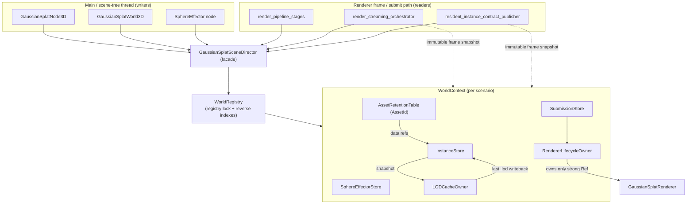

# ADR: Decompose the `GaussianSplatSceneDirector` god-class around owned-state boundaries

- **Status:** Proposed — design-only. This PR adds **no production code**; each
  migration step below lands as its own PR referencing this ADR.
- **Risk class:** R2 for the ADR and the early host-side extraction steps
  (module-local, guarded by existing tests). Steps that reorder renderer/GPU teardown
  or move renderer construction/`initialize()` out from under the lock are R2
  (renderer lifetime / GPU resource ownership) and take GPU/perf review; the
  render-thread snapshot step (Step 6) is R2/R3 and needs runtime/GPU evidence plus a
  second review. Per the agentic-engineering risk classes this design note is the
  R2/R3 *design-before-implementation* artifact.
- **Date:** 2026-07-18
- **Baseline:** `237a4b1cc3965fdbd6f12dec825c0e2077b2e9ce` (origin/master).
- **Informs issues:** #356 (decompose orchestration around owned state boundaries —
  the tracked umbrella), #545 (consolidate the four asset-identity schemes behind
  typed IDs), #589 (module teardown destroys the manager before director-owned
  renderers), #551 (encode the PREDELETE/EXIT_TREE/prune ordering structurally),
  #606 (raw `GaussianData` storage consumers bypass the RWLock/snapshot contract —
  adjacent; this ADR removes one class of unsynchronized reader).

## Context / problem

`GaussianSplatSceneDirector` is the singleton between the scene-tree nodes
(`GaussianSplatNode3D`, `GaussianSplatWorld3D`, the sphere-effector node) and the
renderer. `ARCHITECTURE.md:20` labels it "Multi-instance coordination and registry"
and puts it at the head of the data flow — nodes register data/instances *through* it,
and it feeds the streaming system → renderer → pipeline stages (`ARCHITECTURE.md:52-58`).
`renderer-lifetime-ownership.md` records the authoritative role: it owns
`worlds: HashMap<RID, SharedWorld>` where each `SharedWorld` holds the **only strong
`Ref<GaussianSplatRenderer>`** — releasing it is the sole path that frees the renderer's
whole GPU graph — guarded by one `mutable Mutex world_mutex` that must never nest with
the manager's L1–L4 lock hierarchy.

It is a god-class: ~2,383 LOC in
`modules/gaussian_splatting/core/gaussian_splat_scene_director.cpp`, plus the 347-LOC
partial-class TU `scene_director_sphere_effectors.cpp` and `scene_director_internal.h`,
all operating on one nested state blob, `SharedWorld`
(`gaussian_splat_scene_director.h:368-413`), behind a **single coarse mutex**
(`gaussian_splat_scene_director.h:417-418`). `SharedWorld` fuses at least seven
independent responsibilities under that one lock:

| # | Responsibility | Canonical state (`.h`) | Representative methods (`.cpp`) |
|---|---|---|---|
| 1 | **Renderer lifecycle & ownership** | `SharedWorld::renderer` (`:370`) | `_get_or_create_world_for_scenario` → `memnew(GaussianSplatRenderer)` (`:367`); `get_shared_renderer` (`:2376`); `teardown_world_for_scenario` (`:2131`); `_should_prune_world`/`_prune_world_if_unused` (`:727`,`:748`) |
| 2 | **Instance registry** | `instances`, `instance_lookup`, `instance_generation` (`:371-373`) | `register_instance` (`:760`), `update_instance_transform`/`_params` (`:956`,`:1028`), `unregister_instance` (`:1114`) |
| 3 | **Asset retention table** | `asset_records: HashMap<uint64_t, AssetRecord>`, `instance_asset_generation` (`:393-399`,`:374`) | `_retain_asset_record`/`_refresh_asset_record`/`_release_asset_record` (`:559`,`:599`,`:627`) |
| 4 | **Sphere-effector registry** | `sphere_effectors`, `sphere_effector_lookup`, `sphere_effector_generation`, `registration_serial` (`:375-378`) | `update_sphere_effector` (`:1850`), `unregister_sphere_effector`, `_build_sorted_sphere_effector_payload` (`scene_director_sphere_effectors.cpp:26`) |
| 5 | **World-submission store + renderer state restore/rollback** | `world_submission: WorldSubmissionRecord` (`:379-392`) | `submit_world_submission` (`:2037`), `release_world_submission` (`:2083`), `_apply_world_submission_to_renderer`/`_restore_world_submission_renderer` (`:708`,`:689`) |
| 6 | **LOD walk + memoization** | `InstanceRecord::last_lod` (`:326`); `lod_walk_*` cache (`:408-412`) | `update_instance_lods_for_renderer` (`:1214`) |
| 7 | **GPU row/payload building (render thread)** | reads all of the above | `build_instance_buffer_for_renderer` (`:1398`), `build_instance_grading_buffer_for_renderer` (`:1620`), `build_sphere_effector_payload_for_renderer` (`scene_director_sphere_effectors.cpp:154`), `collect_*_assets_for_renderer` (`:2306`,`:2348`) |

`modules/gaussian_splatting/docs/CODEBASE_ASSESSMENT_REPORT.md:55` also records the
**circular dependency** `gaussian_splat_scene_director.h:20` → renderer while the
renderer depends back on core — a layering inversion this decomposition must not deepen.

## 1. Current-state map: contention, reentrancy, and mutation-under-lock hazards

There are **38 `MutexLock lock(world_mutex)` acquisitions** across the two TUs. The lock
is one global mutex over *all* scenarios, so every producer serializes against every
consumer across unrelated worlds. `world_mutex` is the **sole hand-off between two
threads**: the **main / scene-tree thread** (node notifications and property setters —
node processing runs on the main thread via `GaussianSplatManager`'s
`call_deferred(_process_active_nodes_main_thread)`, `gaussian_splat_manager.cpp:610-624,660`)
and the **RenderingServer render thread** (`RendererSceneRenderRD::render_scene` →
`render_scene_instance`, `gaussian_splat_renderer.cpp:2240`), from which every
`*_for_renderer` builder/query executes and which further hops GPU sub-steps onto the RD
command thread via `_dispatch_call_on_render_thread_blocking`.

### 1a. Coarse-lock cross-thread contention (the central defect)

The **render/submit-path** buffer builders and the **main/scene-tree-thread** node
setters take the *same* global lock:

- Render/submit path (called every frame from the renderer —
  `render_pipeline_stages.cpp:314`, `render_streaming_orchestrator.cpp:791,804`,
  `resident_instance_contract_publisher.cpp:350`):
  `build_instance_buffer_for_renderer` (`:1401`), `build_instance_grading_buffer_for_renderer`
  (`:1622`), `build_sphere_effector_payload_for_renderer` (`scene_director_sphere_effectors.cpp:156`),
  `update_instance_lods_for_renderer` (`:1216`), `compute_color_grading_signature_for_renderer`
  (`:1748`), `collect_instance_assets_for_renderer`/`collect_registered_assets_for_renderer`
  (`:2308`,`:2350`).
- Main thread (node setters): `register_instance` (`:765`), `update_instance_transform`
  (`:957`), `update_instance_params` (`:1029`), `update_instance_scene_effector_filter`
  (`:983`), `update_sphere_effector` (`:1858`), `update_instance_color_grading` (`:1676`).

Because the lock is global, a single node moving one splat
(`update_instance_transform`) blocks the render thread's buffer build **for every other
world**, and vice-versa. This is the contention the audit (#356) calls out as hidden
mutable state raising review cost and coupling unrelated features.

### 1b. Expensive / GPU work performed under the global lock

- **Renderer construction under the lock:** `_get_or_create_world_for_scenario` acquires
  the primary `RenderingDevice` and runs `memnew(GaussianSplatRenderer(device))` while a
  caller holds `world_mutex` (`:352-367`); `get_shared_renderer` calls it under the lock
  (`:2377-2378`).
- **GPU initialization under the lock:** `register_instance` calls
  `world->renderer->initialize()` (GPU resource creation) inside its critical section
  (`:802-807`).
- **Renderer contract mutation + restore under the lock:** `submit_world_submission`
  (`:2043`) calls `renderer->apply_world_submission_contract` (`:719`) and, on rollback,
  `renderer->restore_world_submission_runtime_state` (`:702`) — all while holding the
  global lock, stalling every other world's node updates during a world swap.

### 1c. Reentrancy / calling out of the subsystem while holding the lock

The director repeatedly calls **into engine `Node`/`ObjectDB` state** while holding
`world_mutex`, lengthening the critical section and creating a lock-ordering hazard if
any callout ever re-enters the director:

- `_get_world_for_instance` (`:390-403`) and `_get_world_for_effector` (`:415-426`) call
  `ObjectDB::get_instance`, `node->is_inside_world()`, `node->get_world_3d()` under the lock.
- `_build_sorted_sphere_effector_payload` calls `ObjectDB::get_instance` +
  `Object::cast_to<Node>` per effector under the lock
  (`scene_director_sphere_effectors.cpp:102-104`).
- `get_scene_effector_debug_state_for_instance` calls `ObjectDB::get_instance` and reads
  `effector_node->get_name()` under the lock (`scene_director_sphere_effectors.cpp:228`,`:301-304`).
- Both grading paths read renderer state — `p_renderer->get_color_grading()` — under the
  lock (`:1631`, `:1779`).

This violates the house rule that sub-owners rely on caller synchronization / render-thread
dispatch ordering and never nest `world_mutex` with other locks
(`renderer-lifetime-ownership.md`, lock hierarchy L1–L4).

### 1d. Hidden mutation inside a `const` render-thread query

`_build_sorted_sphere_effector_payload` is invoked from `const` render-path methods, yet
it **mutates canonical state and a generation counter through `const_cast`**: when an
effector's scope-root `ObjectID` no longer resolves it flips `scope_root_valid` and bumps
`sphere_effector_generation` via `const_cast<SharedWorld &>` on the render thread
(`scene_director_sphere_effectors.cpp:106-116`). A write side-effect buried in a `const`
render-thread query means a *read* can invalidate a *cache* mid-frame — exactly the
"never hand out mutation from a const query" anti-pattern the renderer refactor split into
`IFrameStateView` vs `IFrameMutationAccess` (`gaussian-renderer-refactor-memory.md`).

### 1e. O(worlds) linear scans under the lock

Reverse lookups are unindexed linear scans of every world:
`_find_world_for_instance` (`:406-413`), `_find_world_for_effector` (`:428-435`),
`_find_world_for_renderer` (`:481-516`), `_find_world_for_world_submission` (`:518-540`);
`register_instance` additionally scans every world for the world-switch eviction
(`:777-801`), and `get_instance_submission` scans all worlds (`:1179-1209`) — each inside
the global critical section.

### 1f. Lifetime/teardown ordering encoded in prose (not types)

- **Teardown order (#589):** `register_types.cpp:247-260` deletes `GaussianSplatManager`
  **before** the director — repeating init order instead of reversing it. The director's
  `~GaussianSplatSceneDirector` then `worlds.clear()`s (`:325-334`) and drops renderer
  `Ref`s whose teardown observes `get_singleton()==nullptr`. Safe today only because
  renderer→manager calls are null-guarded, but the ordering is a latent wrong-device/leak
  edge.
- **Prune-after-unref dance (#551):** ~54-line mirrored comment blocks encode the "unref
  the renderer `Ref` first, *then* re-run the prune so refcount actually falls" ordering
  across node ↔ world ↔ director (`nodes/gaussian_splat_world_3d.cpp:112-166`,
  `nodes/gaussian_splat_node_3d.cpp:460-500`). Correctness depends on prose; any reorder
  silently reintroduces the F6-reload leak.

### 1g. Render-thread-**blocking** renderer calls made under the lock (the headline hazard)

This is the sharpest risk and the one the decomposition exists to remove. Several
main-thread mutators hold `world_mutex` and then call renderer methods that **block waiting
on the render thread**, while the render thread is simultaneously in a `*_for_renderer`
builder blocked on that same `world_mutex` (§1a) — a lock-ordering inversion:

- `register_instance` → `world->renderer->initialize()` (`:805`, under the lock at `:765`);
  `initialize()` runs `_dispatch_call_on_render_thread_blocking(_initialize_on_render_thread)`
  (`gaussian_splat_renderer.cpp:1613-1620`) — it **waits** for the render thread.
- `_prune_world_if_unused` → `worlds.erase(...)` (`:756`) drops the last renderer `Ref`
  (the prune fires precisely when `renderer->get_reference_count() <= 1`, `:745`), running
  `~GaussianSplatRenderer` → `_dispatch_call_on_render_thread_blocking(_teardown_on_render_thread)`
  (`gaussian_splat_renderer.cpp:1244-1248`) **under the lock**. Reached under the lock from
  `unregister_instance` (`:1142`), `unregister_sphere_effector` (`:2034`),
  `update_sphere_effector` (`:1885`), `release_world_submission` (`:2092`), and
  `try_prune_world_if_unused` (`:2100`, the PREDELETE path of both nodes).
- `submit_world_submission` / `_get_or_create_world_for_scenario` /
  `teardown_world_for_scenario` call `apply_world_submission_contract`,
  `restore_world_submission_runtime_state`, `clear_world_submission_contract`, and
  `renderer.unref()` under the lock (`:2069-2075`, `:373-377`, `:2154-2165`).

The one place that already does it right is `invalidate_grading_for_renderer`, which bumps
the renderer's atomic **before** taking `world_mutex` (`:1727` vs `:1731`). Generalizing
that rule — *never call a blocking renderer method while holding the registry lock* — is a
primary goal of the `RendererLifecycleOwner` boundary (§2) and the snapshot step (§4 Step 6).

### 1h. Stale/latent decomposition traps

- **`teardown_world_for_scenario` has no production caller** — only
  `tests/test_renderer_lifetime_proof.h:819` invokes it — yet its header doc
  (`gaussian_splat_scene_director.h:253-265`) still claims it is "Called by
  GaussianSplatWorld3D and GaussianSplatNode3D from NOTIFICATION_PREDELETE." Both PREDELETE
  handlers now deliberately use the ownership-aware `release_world_submission` +
  `try_prune_world_if_unused` instead (`gaussian_splat_node_3d.cpp:460-500`,
  `gaussian_splat_world_3d.cpp:112-166`). The decomposition must not preserve the stale doc.
- **Dead node-reading helpers** `_get_node_scene_effector_filter_state` (`:181`, reads the
  live node via `p_node->get(...)`) and `_node_matches_scene_effector_selection` (`:224`,
  uses `ObjectDB::get_instance` + `Node::is_ancestor_of`) have **no callers** — they embody
  the pre-refactor "read the live Node from the effector query" pattern the cached-ancestor
  design replaced, and should be deleted during Step 2 rather than carried forward.

## 2. Target decomposition into owned-state boundaries

This ADR applies the module's existing decomposition idiom, which comes in three kinds:

- **Kind A — pure/static controllers** that own no state and take caller state by ref
  (e.g. `ResidencyBudgetController`, `residency_budget_controller.h`;
  `StreamingQueuePressureController`).
- **Kind B — stateful `friend` controllers** owned by value on the coordinator, holding
  one state slice, reaching shared state through `System &` (e.g.
  `StreamingEvictionController`, `streaming_eviction_controller.h:9-64`).
- **Kind C — POD state buckets** with `reset()`/getters only (`streaming_runtime_state.h`),
  plus the renderer's `std::unique_ptr` orchestrators built from an injected
  `Dependencies`/`RuntimePorts` seam (`gaussian_splat_renderer.h:633-643`).

The governing rules are those in `stage-first-ownership-inventory.md` ("Ownership Rules"):
one subsystem owns each mutable bucket; workers produce payloads but never mutate
owner state; render-thread dispatch/readback/resource tracking has a single authoritative
owner; hidden process-global caches are debt unless assigned an owner; existing seams are
contracts. The composition root owns each unit and keeps the god-class as the public
**facade** while peeling behind it (`gaussian-renderer-refactor-memory.md`).

`SharedWorld` is renamed **`WorldContext`** and holds one instance of each sub-store by
value; the director becomes a thin **facade + `WorldRegistry`** that resolves a scenario
to its `WorldContext` and routes calls to the owning store. Proposed units, each described
with the four house fields (owned state / locking / canonical-vs-derived / wiring):

- **`WorldRegistry`** (Kind B).
  *Owns:* `HashMap<RID, WorldContext>` **and** the reverse-index maps
  (`node_id→RID`, `effector_id→RID`, `renderer*→RID`, `submission_owner→RID`) that replace
  the four O(worlds) scans (§1e).
  *Locking:* owns the top-level registry mutex; critical sections are short (locate /
  create-empty / erase). It never calls into `Node`/`ObjectDB` under the lock — node→world
  resolution runs on the caller (main) thread and passes an already-resolved `RID` in (fixes §1c).
  *Canonical/derived:* map is canonical; reverse indexes are derived, maintained on every insert/erase.
  *Wiring:* the sole owner of the `worlds` map; the facade delegates all resolution here.
- **`RendererLifecycleOwner`** (Kind B).
  *Owns:* `WorldContext::renderer`, its creation, `initialize()`, world-submission
  apply/restore handoff, teardown, and the `_should_prune_world` refcount policy (`:727`).
  *Locking:* enforces the rule *never call a blocking renderer method while holding the
  registry lock* — renderer construction, GPU `initialize()`, world-submission apply/restore,
  and the `renderer.unref()`/dtor teardown all run **outside** the registry lock
  (deferred-creation token; §1b, §1g), generalizing the one correct precedent
  (`invalidate_grading_for_renderer` bumps the renderer atomic before locking, `:1727`/`:1731`).
  Owns a `PruneAfterUnref` scoped guard that performs unref+prune atomically so the §1f
  ordering cannot be expressed wrong (closes #551), and drives the corrected
  director-before-manager teardown order (closes #589). Destruction is idempotent, matching
  the renderer teardown guard precedent.
  *Canonical/derived:* the renderer `Ref` is canonical (still the only strong ref).
- **`InstanceStore`** (Kind B/C).
  *Owns:* `instances` + `instance_lookup` + `instance_generation`; register/update/unregister
  and world-switch migration.
  *Locking:* mutated only under the owning `WorldContext` write path; exposes a read-only
  snapshot for readers (§3).
  *Canonical/derived:* records canonical; `instance_generation` is the derived invalidation token.
- **`AssetRetentionTable`** (Kind B).
  *Owns:* `asset_records` + refcounts + `instance_asset_generation`, and is the **single owner
  of the asset-identity key contract**. Introduces a strong typedef `AssetId` (64-bit ObjectID)
  so the "never truncate to 32 bits" rule (`gaussian_splat_scene_director.h:444`) is enforced by
  the type, not comments — the first concrete step of #545.
- **`SphereEffectorStore`** (Kind B).
  *Owns:* `sphere_effectors` + `sphere_effector_lookup` + `sphere_effector_generation` +
  `registration_serial`. The sorted-payload builder becomes a **pure function over an immutable
  snapshot** (Kind A helper); scope-root liveness revalidation (and the `scope_root_valid` /
  generation write) moves to an explicit main-thread `revalidate_scope_roots()`, removing the
  `const_cast` render-thread mutation (§1d).
- **`SubmissionStore`** (Kind B).
  *Owns:* `world_submission` + the renderer restore-state snapshot; drives apply/rollback through
  a `RendererLifecycleOwner` handle. Isolates ownership-arbitration and rollback (`:2049-2080`)
  from instance/effector churn.
- **`LODCacheOwner`** (Kind B).
  *Owns:* the `lod_walk_*` memoization; performs the LOD walk over an `InstanceStore` snapshot and
  writes `last_lod` deltas back through `InstanceStore` — separating the derived LOD value from the
  canonical instance record (§3).

The per-instance **scene-effector filter cache** (`scene_tree_ancestor_ids`, layer mask, scope
root — `gaussian_splat_scene_director.h:334-341`) stays on the instance record but is written only
through the main-thread `update_instance_scene_effector_filter` path (`:982`); documented as
`InstanceStore`-owned derived state. No unit introduces a process-global lock, per the house rule.

## 3. Canonical vs derived/cached state and invalidation protocols

The module uses three standard invalidation mechanisms — **generation counters**,
**signatures / remembered-config comparisons**, and **dirty flags + dirty-index lists**.
The director today uses only generation counters plus one memoization signature; the target
keeps that protocol but gives each counter a single writing owner.

| State | Kind | Owner (target) | Invalidation protocol |
|---|---|---|---|
| `instances`, `instance_lookup` | Canonical | `InstanceStore` | n/a (source of truth) |
| `asset_records` (data + refcount) | Canonical | `AssetRetentionTable` | refcount → 0 erases (`:635-638`) |
| `sphere_effectors`, `sphere_effector_lookup` | Canonical | `SphereEffectorStore` | n/a |
| `world_submission` record | Canonical | `SubmissionStore` | active flag + renderer restore snapshot |
| `renderer` `Ref` (only strong ref) | Canonical | `RendererLifecycleOwner` | refcount prune policy (`_should_prune_world`, `:727`) |
| `instance_generation` / `instance_asset_generation` / `sphere_effector_generation` | Derived (invalidation tokens) | resp. store | monotonic bump on mutation (`_bump_instance_generation`, `:23`); wrap-skips-0 |
| `lod_walk_*` cache | Derived (memoization) | `LODCacheOwner` | early-out when `(generation, camera_pos, LODConfig, hysteresis)` unchanged (`:1228-1234`); re-captured *after* the walk's own bump (`:1302-1306`) |
| color-grading signature | Derived (recomputed) | facade query over `InstanceStore` | FNV-1a hash over the exact filtered grading set (`:1743-1811`); feeds the renderer sort/raster cache |
| GPU row/payload buffers | Derived (rebuilt per frame) | render-path consumers | rebuilt from the generation counters each frame |
| `InstanceRecord::last_lod` | **Derived stored on canonical record** | `InstanceStore` (written by `LODCacheOwner`) | today mutated on the render thread (`:1286`) — routed through the owner in the target |
| per-instance scene-effector filter | Derived | `InstanceStore` | refreshed on the main thread via `update_instance_scene_effector_filter` (`:982`) |

Two invariants the decomposition makes explicit:

1. **Generation counters are the sole cross-store invalidation currency**, each with a single
   writing owner, so a reader can no longer bump another store's counter mid-frame (§1d).
2. **Derived state must not be mutated by a `const` reader.** `last_lod` and `scope_root_valid`
   are the two derived values currently written from render-thread read paths; the target routes
   `last_lod` through `LODCacheOwner`→`InstanceStore` and moves `scope_root_valid` revalidation to
   a main-thread step, so the render snapshot is genuinely read-only
   (`IFrameStateView`-style read/mutate split).

## 4. Staged, mergeable migration path

Every step is one PR, keeps CI green (module guards + targeted tests + the existing
lifetime/effector/asset-identity suites), preserves behavior, and is anchored to its base SHA.
No big-bang. The mechanical model is the already-merged `scene_director_sphere_effectors.cpp`
partial-class extraction (`scene_director_sphere_effectors.cpp:1-16`) — verbatim move, no
declaration changes, then tighten ownership. Migrate **query paths before mutating paths**, in
small reversible slices with named rollback points (`gaussian-renderer-refactor-memory.md`).

**Step 1 — `AssetRetentionTable` + typed `AssetId` (R1).**
Move `asset_records`, refcount, `instance_asset_generation`, and the four `_*_asset_record`
helpers (`:559-639`) into an owned `AssetRetentionTable` held by `WorldContext`; introduce a
strong-typedef `AssetId` and route `_asset_records_key` (`gaussian_splat_scene_director.h:444`) and
`InstanceRecord::asset_id` through it.
*Behavior-preservation proof:* the collision regression (`test_asset_records_key` /
`test_has_asset_record_for_scenario`, `gaussian_splat_scene_director.h:281-293`) and the
asset-record-count tests pass unchanged; the 64-bit key path is now type-enforced.
*Closes:* first concrete slice of #545; a subsystem-reviewable slice of #356.

**Step 2 — `SphereEffectorStore` + remove the `const_cast` render-thread mutation (R1).**
Move effector state and methods (`update_sphere_effector` `:1850`, `unregister_sphere_effector`,
`_build_sorted_sphere_effector_payload`) into `SphereEffectorStore`. Split scope-root revalidation
into an explicit `revalidate_scope_roots()` invoked on the main thread; the render-path builder
becomes a pure function over an immutable snapshot (§1d, §3-invariant-2). Delete the two dead
node-reading helpers (`:181`, `:224`, §1h) in the same PR.
*Behavior-preservation proof:* the sphere-effector suite (payload ordering, scope filtering,
multi-match warnings) and `get_scene_effector_debug_state_for_instance` output are byte-identical
for a fixed frame; a new unit asserts the payload builder performs no writes.
*Closes:* the hidden-mutable-state slice of #356.

**Step 3 — `WorldRegistry` reverse indexes + `RendererLifecycleOwner`, corrected teardown order +
`PruneAfterUnref` guard (R2).**
Replace the four O(worlds) scans (§1e) with maintained reverse-index maps; move renderer ownership,
`_should_prune_world`/prune, and teardown into `RendererLifecycleOwner`; reverse the module teardown
to director-before-manager (`register_types.cpp:247-260`); express the node/world unref+prune dance
as a single `PruneAfterUnref` scoped guard (replacing the prose in
`gaussian_splat_world_3d.cpp:112-166` and `gaussian_splat_node_3d.cpp:460-500`). Move the blocking
renderer calls (`initialize()`, apply/restore, `renderer.unref()`/dtor) out of the registry lock
(§1g), and correct the stale `teardown_world_for_scenario` header doc (§1h).
*Behavior-preservation proof:* `test_renderer_lifetime_proof` (F6 reload / scenario-close no-leak)
and the RID-count lifetime tests pass; add a retained-renderer shutdown regression per #589.
*Closes:* #589, #551; the renderer-lifetime slice of #356.

**Step 4 — `InstanceStore` extraction (R1).** Move `instances`, `instance_lookup`,
`instance_generation`, and register/update/unregister/world-switch logic (`:760-1143`) behind
`InstanceStore`, exposing a read-only snapshot accessor; facade methods delegate.
*Proof:* instance-registration and world-switch migration tests unchanged.

**Step 5 — `LODCacheOwner` + `SubmissionStore` extraction (R2).** Move the LOD walk and `lod_walk_*`
cache (`:1214-1307`) into `LODCacheOwner`, routing `last_lod` writes back through `InstanceStore`;
move world-submission apply/rollback (`:2037-2093`) into `SubmissionStore` driving
`RendererLifecycleOwner`.
*Proof:* LOD-hysteresis and world-submission ownership-arbitration/rollback tests unchanged;
visual gate on Grandma's House (renderer-facing).

**Step 6 — render-thread frame snapshot; retire the coarse lock (R2/R3).** With each store owning
its slice and readers already snapshot-based (Steps 2–5), publish an immutable per-`WorldContext`
frame snapshot (copy-on-publish / double-buffer, or a `thread_local` snapshot keyed by a compact
signature per the refactor-memory precedent) that the render-path builders consume **without**
taking the writers' lock, eliminating §1a contention and moving renderer construction/`initialize()`
fully out of any registry critical section (§1b).
*Proof:* GPU/runtime evidence that per-frame buffers are byte-identical to the pre-change path on a
captured scene, plus a contention/latency measurement; second review. Explicitly gated — does not
merge until Steps 1–5 have de-risked the boundaries.

## 5. Risks, rejected alternatives, and issue-closure mapping

### Risks

- **Behavior drift in render output.** Mitigation: every step is byte-identical for a fixed frame;
  renderer-facing steps (5, 6) additionally require the visual gate on real-scan content and GPU
  evidence, per R2.
- **Lock-granularity regressions / new deadlocks.** The pre-existing latent inversion is the
  render-thread-blocking renderer call made under the lock (§1g); Step 3 removes it by moving all
  blocking renderer calls out of the registry critical section *before* any locking is loosened.
  Steps 1–5 otherwise keep the *single* lock and only relocate state; finer locking arrives only at
  Step 6 behind snapshot publication, and no store calls into `Node`/`ObjectDB` while holding a lock
  (§1c). The `world_mutex`↔manager-L1–L4 non-nesting invariant is preserved throughout.
- **Identity-scheme churn.** `AssetId` is introduced first and in isolation (Step 1); the streaming
  `uint32` slot and dense/resident id schemes (#545) are documented here but converted in their own
  follow-ups so this ADR's steps stay small.
- **Circular core→renderer dependency** (`CODEBASE_ASSESSMENT_REPORT.md:55`). `RendererLifecycleOwner`
  is the natural seam to later invert via an interface, but this ADR does **not** attempt the
  inversion — it must not deepen the coupling.

### Rejected alternatives

- **Big-bang rewrite into separate classes in one PR.** Rejected: unreviewable, cannot prove
  behavior preservation step-by-step, and violates the small-reversible-slice house rule.
- **Per-`WorldContext` mutex instead of snapshots (finer locking, same model).** Rejected as the
  *first* move: it keeps render-thread readers contending with writers (just per-world) and does not
  remove GPU-work-under-lock; the snapshot approach (Step 6) removes both. A per-world lock may still
  be adopted for the *write* side under Step 6.
- **Splitting only by translation unit (more `scene_director_*.cpp` files, shared `SharedWorld`).**
  Rejected: that is what `scene_director_sphere_effectors.cpp` already did; it shrinks the file but
  leaves the single lock, the shared blob, and the hidden mutation intact. The goal is owned-state
  boundaries, not just file count.

### Issue-closure mapping

| Step | Primarily closes / advances |
|---|---|
| 1 | #545 (typed `AssetId`), #356 |
| 2 | #356 (hidden mutable state / `const_cast` write) |
| 3 | #589, #551, #356 |
| 4 | #356 |
| 5 | #356 (LOD + submission ownership) |
| 6 | #356 (coarse-lock contention); unblocks perf work; adjacent relief for #606 (fewer unsynchronized readers) |

## Exit check

The decomposition is complete when: (1) `SharedWorld`/`WorldContext` no longer exposes a raw mutable
blob — each field is owned by exactly one store; (2) no `const` method mutates state or a generation
counter; (3) the render-path builders take no lock the main-thread setters take; (4) renderer
construction, `initialize()`, and teardown never run inside a registry critical section; (5) the
node/world/director unref+prune ordering (#551) and module teardown order (#589) are expressed in
types, not comments; and (6) `AssetId` is a type, so an asset-identity mis-pick fails to compile (#545).

## Decisions the owner needs to make

- **D1 — Scope of this ADR's follow-ups.** Approve Steps 1–5 (host-side ownership, R1/R2) as the
  committed sequence, with Step 6 (snapshot / coarse-lock retirement, R2/R3) re-approved separately
  once Steps 1–5 land?
- **D2 — Snapshot mechanism (Step 6).** Copy-on-publish double-buffer per `WorldContext` vs a
  `thread_local` signature-keyed snapshot (refactor-memory precedent)? Decide before Step 6, not now.
- **D3 — Identity consolidation depth.** Does #545 close at "`AssetId` typed" (Step 1), or must the
  streaming `uint32` slot + dense/resident id schemes also be typed in follow-ups tracked here?
- **D4 — Core→renderer dependency inversion.** Out of scope for these steps (D-confirm), or should a
  later step introduce a renderer interface at the `RendererLifecycleOwner` seam?

## Non-goals

- No renderer-side split (that is #356's renderer half — separate ADRs/PRs).
- No on-disk format, public API, or GDScript-surface change.
- No dependency inversion of the core→renderer edge in these steps (see D4).
