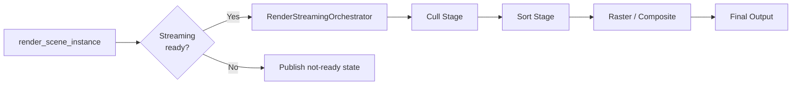

# Render Pipeline Architecture

This document describes the runtime render pipeline in detail: frame entry, route selection, stage execution, and fallback behavior.

## Canonical Pipeline Entry Points

- Frame entry: [../../modules/gaussian_splatting/renderer/gaussian_splat_renderer.cpp](../../modules/gaussian_splatting/renderer/gaussian_splat_renderer.cpp) (`render_scene_instance`)
- Streaming path orchestration: [../../modules/gaussian_splatting/renderer/render_streaming_orchestrator.cpp](../../modules/gaussian_splatting/renderer/render_streaming_orchestrator.cpp)
- Instancing execution mode decisions: [../../modules/gaussian_splatting/renderer/render_instancing_orchestrator.cpp](../../modules/gaussian_splatting/renderer/render_instancing_orchestrator.cpp)
- Stage runner interface: [../../modules/gaussian_splatting/renderer/render_pipeline_stages.h](../../modules/gaussian_splatting/renderer/render_pipeline_stages.h)
- Stage implementations: [../../modules/gaussian_splatting/renderer/render_pipeline_stages.cpp](../../modules/gaussian_splatting/renderer/render_pipeline_stages.cpp)
- Tile raster/resolve backend: [../../modules/gaussian_splatting/renderer/tile_render_stages.cpp](../../modules/gaussian_splatting/renderer/tile_render_stages.cpp)

## Frame Execution Flow

1. `GaussianSplatRenderer::render_scene_instance` initializes per-frame state and camera/view context.
2. Renderer decides route: streaming route via `RenderStreamingOrchestrator` when streaming buffers/readiness are valid, otherwise it records explicit not-ready/readiness state and skips the frame.
3. `RenderPipelineStages` runs stage sequence: cull (`execute_cull_stage`), sort (`execute_sort_stage`), then raster/composite (`render_sorted_splats_with_context`).
4. Output and diagnostics are finalized.

## Backend Route Policy (Resident vs Streaming)

`GaussianSplatRenderer::render_scene_instance` picks a resident or a streaming
backend for the frame via `build_frame_backend_plan`. The requested policy comes
from the project setting `rendering/gaussian_splatting/streaming/route_policy`
(`GS_ROUTE_RESIDENT` or `GS_ROUTE_STREAMING`, default streaming), refined by
`should_prefer_resident_backend` using the active world submission's residency
hint; `GaussianSplatNode3D` (direct per-instance content) always publishes a
resident hint regardless of `route_policy`. A `single_route_per_frame` invariant
means there is no same-frame fallback between backends: if the resident backend
is preferred but not feasible, the frame is skipped rather than retried on the
streaming backend. There is no separate "single-pass vs serial" execution-mode
toggle — that control surface was removed by #326 (b153169114a, 2026-05-12).

Related sources:

- [../../modules/gaussian_splatting/renderer/gaussian_splat_renderer.cpp](../../modules/gaussian_splatting/renderer/gaussian_splat_renderer.cpp) (`build_frame_backend_plan`, `should_prefer_resident_backend`)
- [../../modules/gaussian_splatting/renderer/render_streaming_orchestrator.cpp](../../modules/gaussian_splatting/renderer/render_streaming_orchestrator.cpp)

## Stage Contracts

### Cull Stage

- Inputs: view transform/projection + viewport + frame/provider context
- Output: visible count and visible-domain information
- Contract owner: `RenderPipelineStages::CullStage`

### Sort Stage

- Inputs: world-to-camera transform + cull outputs
- Output: sorted indices and output-domain metadata
- Contract owner: `RenderPipelineStages::SortStage`

### Raster and Composite

- `RenderPipelineStages::render_sorted_splats_with_context` prepares raster/composite inputs
- `TileRenderer` performs tile pipeline and resolve passes
- Output compositor handles final target/viewport handoff

## Fallback and Failure Semantics

When prerequisites are missing (device, buffers, or readiness invariants), the renderer records explicit readiness state and avoids publishing invalid stage results.

Relevant code:

- [../../modules/gaussian_splatting/renderer/gaussian_splat_renderer.cpp](../../modules/gaussian_splatting/renderer/gaussian_splat_renderer.cpp)
- [../../modules/gaussian_splatting/renderer/render_pipeline_stages.cpp](../../modules/gaussian_splatting/renderer/render_pipeline_stages.cpp)
- [../../modules/gaussian_splatting/renderer/render_diagnostics_orchestrator.cpp](../../modules/gaussian_splatting/renderer/render_diagnostics_orchestrator.cpp)

## Related Docs

- [Architecture overview](overview.md)
- [Lighting details](lighting-system.md)
- [Memory and residency design](../../modules/gaussian_splatting/MEMORY_SUBSYSTEM.md)
