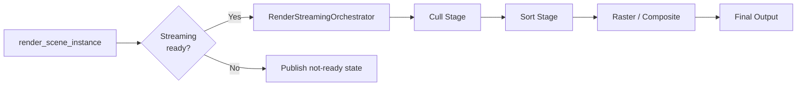

# Render Pipeline Architecture

This document describes the runtime render pipeline in detail: frame entry, route selection, stage execution, and fallback behavior.

## Canonical Pipeline Entry Points

- Frame entry: [../../modules/gaussian_splatting/renderer/gaussian_splat_renderer.cpp](../../modules/gaussian_splatting/renderer/gaussian_splat_renderer.cpp) (`render_scene_instance`)
- Streaming path orchestration: [../../modules/gaussian_splatting/renderer/render_streaming_orchestrator.cpp](../../modules/gaussian_splatting/renderer/render_streaming_orchestrator.cpp)
- Instancing execution mode decisions: [../../modules/gaussian_splatting/renderer/render_instancing_orchestrator.cpp](../../modules/gaussian_splatting/renderer/render_instancing_orchestrator.cpp)
- Stage runner interface: [../../modules/gaussian_splatting/renderer/render_pipeline_stages.h](../../modules/gaussian_splatting/renderer/render_pipeline_stages.h)
- Stage implementations: [../../modules/gaussian_splatting/renderer/render_pipeline_stages.cpp](../../modules/gaussian_splatting/renderer/render_pipeline_stages.cpp)
- Tile raster/resolve backend: [../../modules/gaussian_splatting/renderer/tile_render_stages.cpp](../../modules/gaussian_splatting/renderer/tile_render_stages.cpp)

## Frame Execution Flow

1. `GaussianSplatRenderer::render_scene_instance` initializes per-frame state and camera/view context.
2. Renderer decides route: streaming route via `RenderStreamingOrchestrator` when streaming buffers/readiness are valid, otherwise it records explicit not-ready/readiness state and skips the frame.
3. `RenderPipelineStages` runs stage sequence: cull (`execute_cull_stage`), sort (`execute_sort_stage`), then raster/composite (`render_sorted_splats_with_context`).
4. Output and diagnostics are finalized.

## Backend Route Policy (Resident vs Streaming)

`GaussianSplatRenderer::render_scene_instance` picks a resident or a streaming
backend for the frame via `build_frame_backend_plan`. The requested policy comes
from the project setting `rendering/gaussian_splatting/streaming/route_policy`
(`GS_ROUTE_RESIDENT` or `GS_ROUTE_STREAMING`, default streaming), refined by
`should_prefer_resident_backend` using the active world submission's residency
hint; `GaussianSplatNode3D` (direct per-instance content) always publishes a
resident hint regardless of `route_policy`. A `single_route_per_frame` invariant
means there is no same-frame fallback between backends: if the resident backend
is preferred but not feasible, the frame is skipped rather than retried on the
streaming backend. There is no separate "single-pass vs serial" execution-mode
toggle — that control surface was removed by #326 (b153169114a, 2026-05-12).

Related sources:

- [../../modules/gaussian_splatting/renderer/gaussian_splat_renderer.cpp](../../modules/gaussian_splatting/renderer/gaussian_splat_renderer.cpp) (`build_frame_backend_plan`, `should_prefer_resident_backend`)
- [../../modules/gaussian_splatting/renderer/render_streaming_orchestrator.cpp](../../modules/gaussian_splatting/renderer/render_streaming_orchestrator.cpp)

## Stage Contracts

### Cull Stage

- Inputs: view transform/projection + viewport + frame/provider context
- Output: visible count and visible-domain information
- Contract owner: `RenderPipelineStages::CullStage`

### Sort Stage

- Inputs: world-to-camera transform + cull outputs
- Output: sorted indices and output-domain metadata
- Contract owner: `RenderPipelineStages::SortStage`

### Raster and Composite

- `RenderPipelineStages::render_sorted_splats_with_context` prepares raster/composite inputs
- `TileRenderer` performs tile pipeline and resolve passes
- Output compositor handles final target/viewport handoff

## Composite Binding Contract (GPU-001, Option B: pre-tonemap/pre-upscale)

Where the splat composite lands in the engine frame is a **contract**, decided
by the maintainer on 2026-08-16 (Phase-2 decision memo, Option B; refs #921).

**Ordering.** On the forward-clustered renderer, single view, non-probe, the
engine runs the Gaussian render+composite *inside* `_render_scene`, at the
pre-upscale seam: after the MSAA resolve and the SSIL framebuffer copy, before
the FSR2/MetalFX-temporal/TAA block and before
`_render_buffers_post_process_and_tonemap` (see the "Gaussian Splats
Pre-Upscale" block in
[`render_forward_clustered.cpp`](../../servers/rendering/renderer_rd/forward_clustered/render_forward_clustered.cpp),
`RenderForwardClustered::_render_scene`). This places the write before *every*
consumer of the internal color texture — FSR2 reads it as `params.color`,
TAA processes it, tonemap consumes it last — which is what fixes
GS-AUDIT-GPU-001 (the legacy post-scene hook wrote the internal texture after
those consumers, so splats were absent on every scaled/temporal viewport at the
shipped default `composite/depth_test=true`).

**Target.** In the pre-upscale phase the composite destination is pinned to the
internal scene color buffer; the historical present-target redirect and the
present-framebuffer graphics blend are disabled for this phase
(`OutputCompositor::integrate_final_output`, `pre_upscale_phase` in
[`output_compositor.cpp`](../../modules/gaussian_splatting/interfaces/output_compositor.cpp)).
Depth compare runs at internal resolution on both sides, so no rescaled depth
sampling is needed.

**Source encoding.** The splat raster output is premultiplied, sRGB-encoded,
display-referred LDR — the raster target format is coerced to RGBA8 UNORM by
`_resolve_compute_friendly_raster_format`
([`render_pipeline_stages.cpp`](../../modules/gaussian_splatting/renderer/render_pipeline_stages.cpp)).
The pre-upscale destination is the *linear* pre-tonemap scene buffer, so the
compute blit decodes the source sRGB→linear on straight (un-premultiplied)
color before blending (`source_decode_srgb` in
[`viewport_blit.glsl`](../../modules/gaussian_splatting/shaders/viewport_blit.glsl)
and its host mirror `ViewportBlitPushConstant`). Splats therefore pass through
the same tonemap/exposure as meshes.

**Scoping (documented fallbacks).**

- **Multiview/XR is excluded from this contract**: the compute blit's
  `sampler2D`/`image2D` bindings cannot address the multiview 2D-array internal
  color (`_copy_final_output_compute`'s scratch-fill exclusion in
  `output_compositor.cpp`), so `view_count > 1` keeps the legacy post-scene
  composite path with its pre-existing behavior.
- **Forward mobile** has no pre-upscale hook yet; it keeps the legacy
  post-scene path (mobile-parity delta tracked as follow-up work on #921).
- **Reflection probes** never run post-process and keep the legacy path.
- The legacy hook in `RendererSceneRenderRD::render_scene` is gated on
  `render_data.gaussian_composite_pre_upscale` so the two phases can never
  double-composite.

**Residual risk (named, not covered by the six-config oracle).** Splats publish
no motion vectors, no FSR2 reactive-mask contribution, and no depth write-back
(`viewport_blit.glsl` writes color only), so FSR2/TAA/MetalFX-temporal may
ghost splat regions under motion — this is invisible to still-frame diffs and
requires human eyes on motion captures.

The ordering, phase gating, and encoding mirror are guarded by
[`tests/ci/check_gs_pre_upscale_hook.py`](../../tests/ci/check_gs_pre_upscale_hook.py)
in the `--guard-only` lane.

## Fallback and Failure Semantics

When prerequisites are missing (device, buffers, or readiness invariants), the renderer records explicit readiness state and avoids publishing invalid stage results.

Relevant code:

- [../../modules/gaussian_splatting/renderer/gaussian_splat_renderer.cpp](../../modules/gaussian_splatting/renderer/gaussian_splat_renderer.cpp)
- [../../modules/gaussian_splatting/renderer/render_pipeline_stages.cpp](../../modules/gaussian_splatting/renderer/render_pipeline_stages.cpp)
- [../../modules/gaussian_splatting/renderer/render_diagnostics_orchestrator.cpp](../../modules/gaussian_splatting/renderer/render_diagnostics_orchestrator.cpp)

## Related Docs

- [Architecture overview](overview.md)
- [Lighting details](lighting-system.md)
- [Memory and residency design](../../modules/gaussian_splatting/MEMORY_SUBSYSTEM.md)
