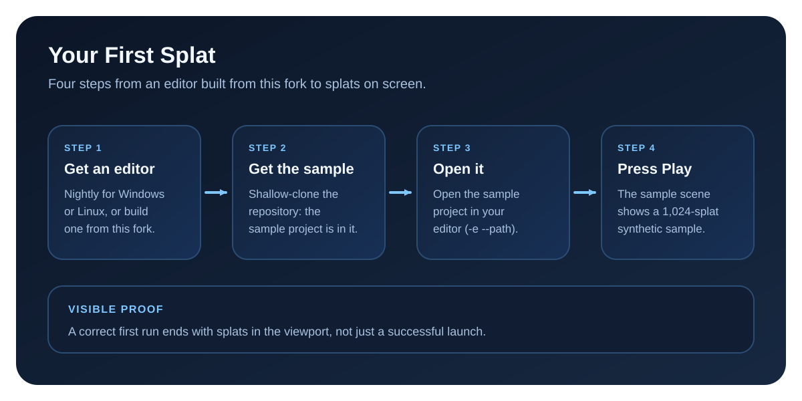

# Your First Splat

The shortest honest path to a visible result: get an editor built from this fork, open the sample project, press Play and see a splat in the viewport.

This page covers the nightly editors and editors you built yourself. On macOS there is no published binary, so start with [Build from Source](../BUILDING.md) and come back to step 2.

Real editor screenshots for this flow are still pending, so this page stays text-first and keeps the diagram as a technical reference at the end.

## 1. Get an Editor

A stock Godot editor does not work: you need an editor built from this fork.

- **Linux:** download `godotgs-linux-x86_64-<tag>.tar.xz` from the most recent `nightly-YYYYMMDD` release. Every nightly has it.
- **Windows:** download `godotgs-windows-x86_64-<tag>.zip` from the most recent nightly that lists it. The Windows zip is attached only when that night's Windows build lane passed, so the newest nightly may be Linux-only. The zip contains both the GUI editor and the console wrapper; pick whichever fits your workflow. Do not take `godotgs-export-template-windows-x86_64-<tag>.zip` by mistake: that is the export template for shipping a game, not the editor.
- **macOS:** no published binary. Build one with [Build from Source](../BUILDING.md).
- **Already built one?** Any editor built from this fork works; see [Installation](installation.md) for prerequisites and build paths.

[Downloads](downloads.md) links the Releases page and explains how to unpack, run and verify each archive.

This page shows that godotGS works, not how fast it is. Before you judge speed, read [Build Flavor and Performance](downloads.md#build-flavor-and-performance) (the Linux nightly is not a performance build) and the [Performance Dashboard](../performance/index.md).

## 2. Get the Sample Project

The sample project lives in this repository, not in the nightly archive. A shallow clone is enough and is far quicker than the full engine history:

```bash
git clone --depth 1 https://github.com/klausi3D/godotGS.git
cd godotGS
```

Run the commands in the next steps from the root of that clone.

## 3. Point at Your Editor and Open the Project

Set `GODOT_BINARY` to the absolute path of your editor, then open the sample project:

```bash
export GODOT_BINARY=/absolute/path/to/godot.linuxbsd.editor.dev.x86_64
$GODOT_BINARY -e --path tests/examples/godot/test_project
```

```powershell
$env:GODOT_BINARY="C:\absolute\path\to\godot.windows.editor.x86_64.exe"
& $env:GODOT_BINARY -e --path .\tests\examples\godot\test_project
```

You should see the sample project open in the editor. The `-e` flag matters: without it, `--path` runs the project's main scene directly instead of opening the editor.

Optional check, useful for an editor you built yourself: open the project headlessly and quit. It should exit without errors.

```bash
$GODOT_BINARY --headless --path tests/examples/godot/test_project --quit
```

```powershell
& $env:GODOT_BINARY --headless --path .\tests\examples\godot\test_project --quit
```

## 4. Press Play

Press Play. The sample project's main scene is `res://scenes/public_evaluator.tscn`. It shows a small synthetic sample (a 1,024-splat test fixture), not a real capture.

You should see:

- a visible splat in the viewport
- the sample scene loaded, with the project still open and interactive

## Next Steps

- Bring in your own capture with the [import workflow](../workflows/importing.md).
- Continue with the [Guides](../user/index.md) for concepts, presets, lighting and the feature guides.

## If It Fails

- Check [Recurring Issues](../troubleshooting/recurring-issues.md).
- Re-check the prerequisites in [Installation](installation.md).
- On macOS, or if no nightly works on your machine, build an editor from this fork with [Build from Source](../BUILDING.md) before retrying.

## Flow Reference

<figure markdown="1">
{ .gs-diagram }
<figcaption>The first-splat path is a short proof loop: point at your editor, open the sample project, and confirm a visible splat in the sample scene.</figcaption>
</figure>
